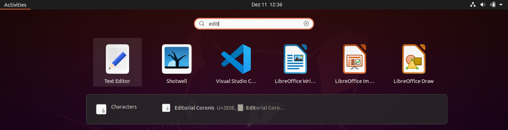
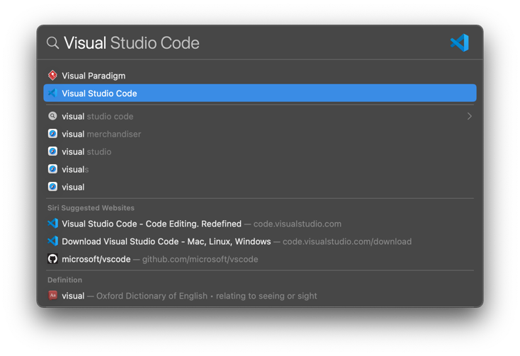
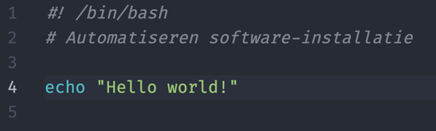
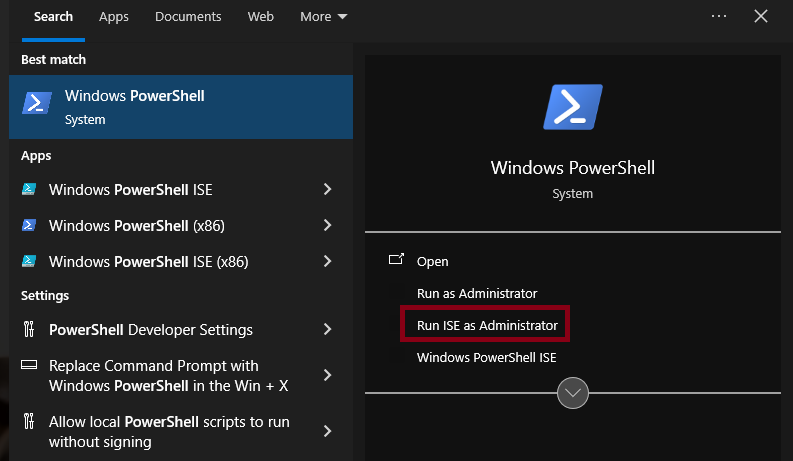
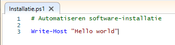
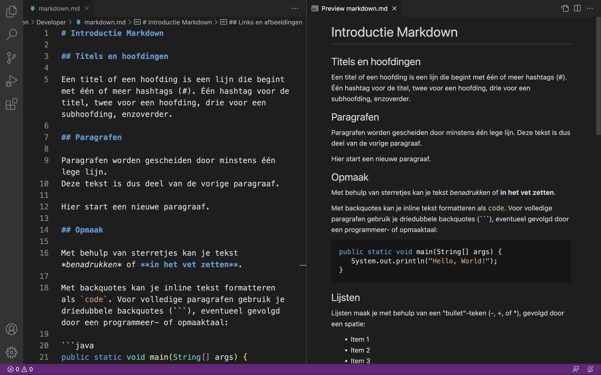

# Opdracht 1 - Package Manager & Markdown

In deze opdracht leer je een techniek aan die je gedurende je studies (en ook daarna) kan helpen bij het installeren en onderhouden van software op je laptop. Meer bepaald leer je een package manager te gebruiken om de installatie en het onderhoud van software meer gecentraliseerd te beheren. Door dit proces te automatiseren met een script, kan je - wanneer je bijv. een nieuwe laptop moet instellen of een clean install doet - een hoop tijd besparen.

## :mortar_board: Leerdoelen

- Je kan een package manager installeren op een besturingssysteem.
- Je kan een package manager gebruiken om software te installeren en te onderhouden.
- Je kan een script schrijven om de installatie van software te automatiseren.

## :bar_chart: Evaluatiecriteria

Toon na afwerken het resultaat aan je begeleider. Elk teamlid moet in staat zijn om het resultaat te demonstreren bij de oplevering van deze opdracht! Criteria voor beoordeling:

- [ ] Je hebt een package manager voor jouw besturingssysteem geïnstalleerd.
- [ ] Je hebt een script (PowerShell of Bash, afhankelijk van je besturingssysteem) geschreven en gebruikt om de opgesomde applicaties te installeren.
- [ ] Je toont inzicht in de werking van een package manager en kan deze vlot kan gebruiken om basistaken uit te voeren.
- [ ] Je hebt een verslag gemaakt op basis van het template.
- [ ] De cheat sheet is aangevuld met nuttige commando's die je wil onthouden.
- [ ] Je kan een correct antwoord geven op de vragen die zijn aangeduid met een :question:.

> Opmerking voor studenten TIAO: elk teamlid toont **individueel alle** evaluatiecriteria. Individuele extra's worden individueel toegelicht.

## :question: Probleemstelling

Gedurende je opleiding zal je verschillende softwarepakketten moeten installeren op je laptop. De meeste applicaties zijn _open source_ en kan je gratis downloaden en installeren. Zowel Windows- als macOS-gebruikers krijgen dan vaak als instructie om naar de website van de applicatie te gaan, die te downloaden en een installatie-wizard te doorlopen. Dit is een tijdrovende bezigheid die moeilijk te automatiseren valt.

Eens geïnstalleerd, krijg je bovendien te pas en te onpas notificaties dat er voor bepaalde applicaties een update beschikbaar is. Dit zorgt voor onderbrekingen en afleiding op momenten dat je met andere zaken wil bezig zijn.

Linux-gebruikers hebben dit soort problemen niet. Je kan de meeste applicaties die je nodig hebt, zowel voor persoonlijk als voor professioneel gebruik, downloaden en installeren via een **package manager**.

Je kan een package manager vergelijken met een App Store, alhoewel het concept op Linux al veel langer bestaat. Je zoekt de applicatie die je wil installeren uit een lijst van duizenden beschikbare **packages** en kan ze installeren met een druk op een knop. Ook het bijwerken van applicaties tot de laatste versie wordt door een package manager gedaan. Je kan een lijst opvragen van alle geïnstalleerde applicaties waarvoor een nieuwe versie beschikbaar is, en die allemaal in één keer bijwerken.

In deze opdracht zal je leren werken met een package manager. Daarna ga je deze kennis toepassen om de installatie van applicaties te automatiseren a.h.v. een **script**. Deze scripts worden doorgaans uitgevoerd in een terminal. Zo'n terminal lijkt op het eerste gezicht misschien een verouderde manier om van een computer iets gedaan te krijgen in vergelijking met een mooie grafische applicatie, maar de terminal en zijn Command Line Interface (CLI) zijn echter de sleutel tot automatisering en zijn essentieel bij het beheren van computersystemen op grote schaal aan de hand van scripting.

_Wat zijn scripts?_

> Scripts zijn bestanden met CLI-instructies die één na één uitgevoerd worden en die toelaten om tijdrovende systeembeheertaken (zoals het installeren van software) te automatiseren.

Hieronder vind je de instructies voor de meest gangbare besturingssystemen: **Windows**, **macOS** en **Linux**. Volg de instructies voor het besturingssysteem dat op jouw laptop geïnstalleerd is. Windows-gebruikers moeten dus bijvoorbeeld niet de instructies voor Linux volgen of omgekeerd, maar het is wel nuttig de instructies voor alle platformen eens door te nemen.

Noteer ook je bevindingen tijdens het doorlopen van deze opdracht. Deze zal je moeten neerschrijven in een **verslag**. Dit verslag zal je maken in **Markdown**, wat besproken wordt op het einde van de opdracht.

## :memo: Opdracht

### Linux

#### Linux als desktop besturingssysteem

Zelfs onder de studenten Toegepaste Informatica zijn de Linuxgebruikers meestal een kleine minderheid. Dit is te begrijpen, want als je een laptop koopt, staat er meestal al Windows op. Desondanks is Linux gebruiken zeker het overwegen waard. Voor de meeste IT-professionals is Linux een uitstekend besturingssysteem. Vele applicaties voor softwareontwikkeling, systeem- en netwerkbeheer, cybersecurity, enz. zijn gratis beschikbaar. Ook voor bekende commerciële applicaties zoals MS Office zijn er compatibele alternatieven beschikbaar (bv. LibreOffice).

Het is jammer genoeg niet eenvoudig om eenduidige instructies voor Linux-gebruikers te formuleren. Eén van de verschillen tussen de vele distributies is immers vaak de _package manager._ In wat hieronder volgt, veronderstellen we dat je **Ubuntu** gebruikt, omdat dat een bekende, stabiele distributie is die ook geschikt is voor beginnende gebruikers. Heb je een andere distributie geïnstalleerd, dan zal je de equivalente commando's voor jouw package manager moeten opzoeken. Als dit niet lukt, contacteer dan je lectoren voor specifieke hulp. Geef zeker mee welke distributie en versie je geïnstalleerd hebt op je laptop.

#### Een script schrijven

Elk Linux-systeem is uitgerust met een krachtige Command Line Interface (CLI), genaamd **Bash**. Er is ook een grote keuze aan applicaties om tekst te bewerken. In deze opdracht gebruiken we de standaard teksteditor, **GEdit**, om een script te schrijven dat de installatie van software die je nodig hebt te automatiseren. Je kan uiteraard ook een andere teksteditor kiezen.

1. Druk op de Windows-toets of klik bovenaan op **Activities** en tik **Edit**. Klik in de lijst met resultaten op **Text Editor** of druk ENTER als het icoontje geselecteerd is.

   

2. Druk opnieuw op de Windows-toets, tik **Terminal** en druk ENTER. Zorg ervoor dat de teksteditor en de terminal elk de helft van het scherm innemen door de titelbalk naar hetzij de linker- hetzij de rechterrand van het scherm te slepen. Je kan ook de toetsenbordcombinatie Windows + pijltje links of pijltje rechts gebruiken.
3. We gaan een eerste eenvoudig script schrijven. Tik in het editor-venster de tekst in zoals in de afbeelding hieronder getoond en sla het script op als **installatie.sh**. De extensie **.sh** is standaard voor Bash-scripts. Kies zelf een geschikte map om het script op te slaan zodat je het later makkelijk kan terugvinden.

   De eerste regel van het script begint met `#!`, de zogenaamde "shebang". Die geeft aan met welke interpreter het script moet uitgevoerd worden (hier: Bash). De tweede regel begint met een hekje (`#`), dit is commentaar die niet uitgevoerd wordt. Regel 4 drukt tekst af op de console.


4. Ga in het terminalvenster met het commando **cd** naar de directory waar je het script hebt opgeslagen. Controleer met het commando **ls** dat het script zich wel degelijk in deze directory bevindt. Voer het commando `chmod +x installatie.sh` uit. Dit zorgt ervoor dat het script uitvoerbaar wordt. Voer het script uit met `./installatie.sh` en controleer dat het resultaat overeenkomt onderstaande afbeelding.

   

Beantwoord nu onderstaande vragen:

- :question: De Bash-prompt toont de map/directory waar we ons nu bevinden. Wat is de naam van de directory waar je in terecht komt als je een Terminal-venster opent?
- :question: In welke directory heb jij het script bewaard?
- :question: In welke directory is het script bewaard in de screenshot onder stap 4?
- :question: (optioneel) Verander de kleuren van de uitvoer, bv. gele tekst op zwarte achtergrond. Tip: zoek op het internet naar "Bash ANSI color codes".

#### De apt package manager

We laten het script even voor wat het is. Sluit de editor nog niet af want zo dadelijk heb je die opnieuw nodig!

Elke Linux-distributie heeft een package manager die toelaat om in een lijst van duizenden beschikbare packages op te zoeken welke je nodig hebt en die met een druk op de knop te installeren. Deze package manager kan je ook altijd vanop de terminal gebruiken.

In Ubuntu gebruik je in de Terminal het commando **apt** om de **a**dvanced **p**ackage **m**anager aan te spreken, dit is de standaard package manager op Ubuntu. Om een applicatie te installeren gebruik je het commando `apt install <packagenaam>`. Voor elk commando dat wijzigingen aan het systeem aanbrengt heb je root-rechten nodig. Deze bekom je door het commando te laten voorafgaan door **sudo**. De eerste keer dat je dit gebruikt in een sessie moet je het wachtwoord van je huidige gebruiker invoeren. Probeer dit eens uit.

Binnen SDP zullen jullie gebruikmaken van het versiebeheersysteem Git. Installeer dit met het commando `sudo apt install git`. Merk op dat **apt** je wellicht vraagt te bevestigen of je Git wel degelijk wil installeren. In een script willen we vermijden dat we om de paar minuten iets moet intikken. Daar zullen we rekening moeten mee houden bij het schrijven van het installatiescript.

Op dit punt wordt het interessant om een lijstje op te bouwen van commando's die je vaak zult nodig hebben. Zoek op welke commando's je nodig hebt voor de hieronder opgesomde taken en neem dit op in de tabel hieronder. Maak bij het opzoeken gebruik van de ingebouwde manual pages (**man-pages**) van het commando `apt`. Deze roep je in de Terminal eenvoudig op met het commando `man apt` of `man apt install`. Je kan het `man`-commando gebruiken in combinatie met zowat elk commando om de documentatie ervan te raadplegen.

| **Taak**                                                                | **Commando** |
| ----------------------------------------------------------------------- | ------------ |
| Een lijst tonen van de software die nu geïnstalleerd is via apt         |              |
| Alle packages die nu geïnstalleerd zijn bijwerken tot de laatste versie |              |
| Via de console een package opzoeken                                     |              |
| Een geïnstalleerde applicatie verwijderen                               |              |

#### Het installatiescript afwerken

We weten nu dat je een applicatie kan installeren met `sudo apt install <packagenaam>`. Pas het script van daarstraks nu aan:

```bash
#! /bin/bash
# Automatiseren software-installatie

echo "=== Bijwerken lijst beschikbare applicaties ==="
sudo apt -y update

echo "=== Algemene applicaties ==="
sudo apt -y install git
```

De optie **-y** zorgt ervoor dat je tijdens de uitvoering van het script niet meer moet bevestigen dat je Git wel wil installeren. Je kan in principe een willekeurig aantal packages tegelijk installeren door de namen toe te voegen aan het commando dat nu enkel Git installeert, gescheiden door spaties. Merk op dat als een applicatie al geïnstalleerd is, je een waarschuwing krijgt, maar het script wel kan verder lopen. Het kan dus geen kwaad om het script verschillende keren na elkaar uit te voeren.

Vele applicaties die je op Windows steevast zelf moet installeren zijn al standaard geïnstalleerd op Linux: een PDF-viewer, webbrowser, mediaspeler, enz. De volgende applicaties zijn wellicht niet standaard geïnstalleerd, maar zijn wel nuttig:

- GitKraken: een grafische applicatie voor het Git versiebeheersysteem (Github Desktop werkt niet op Linux)
- Visual Studio Code: een krachtige teksteditor met syntaxkleuren en ondersteuning voor verschillende programmeer-, scripting- en markuptalen.
- VLC Media Player

Let op! Visual Studio Code en GitKraken zijn niet besschikbaar via **apt**, maar kan je installeren via **snap** of via de Ubuntu Software applicatie. Waarom er meer dan één package manager is en wat het verschil is tussen **apt** en **snap** is iets waar we nu (nog) niet op ingaan, maar je kan dit uiteraard zelf opzoeken (en bevestiging vragen aan je lector). Het juiste commando is:

```bash
sudo snap install --classic code
sudo snap install --classic gitkraken
```

Voor System Engineering Lab heb je volgende applicaties nodig:

- FileZilla: kopiëren van bestanden van/naar servers (via FTP, SFTP, enz.)
- VirtualBox: laat toe om zgn. virtuele computers aan te maken, op te starten en te installeren met een besturingssysteem
- MySQL Workbench

:warning: Let op! Om problemen te vermijden installeer je van VirtualBox best dezelfde versie als binnen het OLOD Operating Systems, namelijk versie 7.0._en geen versie 7.1._

Vervolgens moet je er ook voor zorgen dat je bij een volgende update geen 7.1-versie van VirtualBox installeert. Dit _pinnen_, _freezen_ of _holden_ van een bepaald pakket kan je in elke package manager op een verschillende manier. Met welk commando doe jij dit?

Je kan zelf het installatiescript onderverdelen in "rubrieken", bv. software die je voor verschillende vakken nodig hebt kunnen onder de lijn die "Installatie algemene applicaties" op de console afdrukt. Software die je nodig hebt voor een specifiek vak kan je onder een aparte hoofding plaatsen, bv.

```bash
echo "=== Software voor System Engineering Lab ==="
```

Structureer zelf je script en zorg er eventueel voor dat deze hoofdingen meer in het oog springen, bijvoorbeeld door ze in kleur of met een kadertje errond af te drukken.

Je kan je script ook uitbreiden met applicaties die je nodig hebt voor andere vakken of die je zelf gebruikt maar die niet noodzakelijk nodig zijn voor de opleiding. Zoek eens in de lijst van beschikbare packages naar nuttige applicaties.

Merk op dat je sommige commerciële software (zoals Cisco PacketTracer) niet via **apt** of **snap** kan installeren aangezien deze vaak wel gratis maar niet open source is. Dit soort applicaties zal je nog altijd op de "traditionele" manier manueel moeten installeren...

### macOS

#### Een script schrijven

Elk macOS-systeem is, net als Linux, uitgerust met een krachtige command-line interface (CLI), toegankelijk via de **Terminal** applicatie. De standaard shell op macOS is **Zsh**, maar ook **Bash** - wat je al kent van Linux - is beschikbaar.

In de volgende stappen ga je je eerste script aanmaken:

1. Open een teksteditor zoals Visual Studio Code. Dit kan bvb. met de sneltoets **Cmd + Spatie**.

   

2. Maak een nieuw tekstbestand aan en geef het de inhoud die je ziet in onderstaande afbeelding. Sla dit bestand op als **installatie.sh** (de extensie **.sh** is standaard voor scripts). Kies zelf een geschikte map zodat je het script later makkelijk kan terugvinden. De eerste regel begint met `#!`, de zogenaamde "shebang". Die geeft aan met welke shell het script moet uitgevoerd worden (hier: Bash). De tweede regel begint met een hekje (`#`); dit is commentaar die niet uitgevoerd wordt. Regel 4 toont tekst in de console.

   

3. Open Terminal en gebruik het commando **cd** om te navigeren naar de directory waar je het script hebt opgeslagen. Gebruik het commando **ls** om te verifiëren dat het script zich wel degelijk in deze directory bevindt.
4. Voer het volgende commando uit om van je tekstbestand een uitvoerbaar script te maken:

   ```bash
   chmod +x installatie.sh
   ```

5. Voer het script als volgt uit:

   ```bash
   ./installatie.sh
   ```

6. Controleer dat het resultaat van het script overeenkomt met onderstaande afbeelding.

   

Beantwoord nu onderstaande vragen:

- :question: De shell prompt toont telkens de directory waarin je je bevindt. In welke directory kom je terecht als je een Terminal-venster opent?
- :question: In welke directory heb jij het script bewaard?
- :question: In welke directory is het script bewaard uit het screenshot onder stap 6?

#### De Homebrew package manager

We laten het script even voor wat het is. Sluit de editor nog niet af want zo dadelijk heb je die opnieuw nodig!

Standaard kan je op macOS enkel programma's installeren via de App Store (zoals op iOS) of handmatig; er is geen package manager geïnstalleerd. De App Store bevat vooral commerciële software en games. Wij gaan in deze opdracht gebruik maken van **Homebrew**, een package manager die ontwikkeld is buiten Apple.

Hoe je Homebrew kan installeren en gebruiken, leer je in deze video:
<https://www.youtube.com/watch?v=pn8Vz78Yhas>

#### Het installatiescript afwerken

Je weet nu hoe je een applicatie kan installeren met Homebrew. Elke applicatie die je moet installeren kan je nu toevoegen aan je script, zodat je dit kan automatiseren. Vul het script van daarstraks aan met de applicaties die jij wil installeren:

```bash
#! /bin/bash
# Automatiseren software-installatie

echo "Installatie algemene applicaties"

brew install firefox
```

Merk op dat als een applicatie reeds geïnstalleerd is, je een waarschuwing krijgt, maar het script wel kan verder lopen. Het kan dus geen kwaad om het script verschillende keren na elkaar uit te voeren.

Homebrew zal wel een foutmelding geven als een applicatie reeds aanwezig is, maar niet is geïnstalleerd via Homebrew. In dat geval zal Homebrew de bestaande applicatie niet overschrijven. Je kan er uiteraard wel voor kiezen de applicatie eerst te verwijderen, en daarna via Homebrew opnieuw te installeren.

Enkele nuttige applicaties om te installeren zijn:

- Discord
- Eclipse
- Firefox
- MacDown: een handige tool om verslagen te schrijven in Markdown en te exporteren naar PDF.
- Microsoft Teams
- SourceTree: een krachtige GUI voor Git.
  - Git zelf wordt reeds geïnstalleerd tijdens het installeren van Homebrew.
- Visual Paradigm
- Visual Studio Code
- VLC Media Player

Voor System Engineering Lab heb je bovendien nog volgende applicaties nodig:

- Cyberduck: kopiëren van bestanden van/naar servers (via FTP, SFTP, enz.).
- VirtualBox: laat toe om virtuele machines aan te maken, op te starten en te installeren met een besturingssysteem.
- MySQL Workbench

Voeg deze applicaties ook toe aan je script.

:warning: Let op! Om problemen te vermijden installeer je van VirtualBox best dezelfde versie als binnen het OLOD Operating Systems, namelijk versie 7.0.20 op een Intel Mac en versie 7.1.\* op een Silicon Mac.

Vervolgens moet je er ook voor zorgen dat Homebrew bij een volgende update geen (te) nieuwe minor versie van VirtualBox installeert. Je kan dit doen door in Homebrew bepaalde versies van een pakket te _pinnen_. Met welk commando doe je dit?

Je kan zelf het installatiescript onderverdelen in "rubrieken", bv. software die je voor verschillende vakken nodig hebt kunnen onder de lijn die "Installatie algemene applicaties" op de console afdrukt. Software die je nodig hebt voor een specifiek vak kan je onder een aparte hoofding plaatsen, bv.

```bash
echo "Software voor System Engineering Lab"
```

Merk op dat je sommige commerciële software (zoals Cisco PacketTracer), niet via Homebrew kan installeren. Dit soort applicaties zal je nog altijd op de "traditionele" manier moeten installeren. Ook is niet alle software beschikbaar voor laptops met een M1 of M2 CPU. Waar nodig kunnen de lectoren je helpen om alternatieven te vinden.

### Windows

#### Windows PowerShell ISE

**Windows PowerShell** is een Command Line Interface (CLI) voor Windows-systemen. Je kan dit vergelijken met Bash voor Linux. De Windows PowerShell Integrated Scripting Environment (ISE) laat toe om PowerShell-commando's uit te proberen en ook scripts te schrijven.

1. Druk op de Windows-toets of klik in het zoekveld naast het Windows-icoon linksonder het scherm. Tik "PowerShell" in, en klik op "Run ISE as Administrator". Bevestig dat de ISE veranderingen mag aanbrengen aan je computer.

   

2. In PowerShell ISE heb je drie grote onderdelen: een script-editor, een PowerShell console en een lijst met PowerShell-commando's.

   

   Linksboven zie je een editor voor het schrijven van scripts. Onderaan bevindt zich een PowerShell-console waar je meteen commando's in kan uitvoeren. Rechts zie je een lijst van PowerShell-commando's die je kan doorzoeken.

   We gaan een eerste eenvoudig script schrijven. Indien de script-editor nog niet zichtbaar is, klik dan op de knop **New Script**. Tik vervolgens in het editorvenster de tekst zoals getoond in onderstaande afbeelding, en sla het script op als **Installatie.ps1**. De extensie **.ps1** is standaard voor PowerShell-scripts. Kies zelf een geschikte map om het script in te bewaren zodat je het later makkelijk kan terugvinden.

   

   De eerste regel van het script begint met een hekje (`#`). Dit is commentaar en wordt niet uitgevoerd. Het commando `Write-Host` drukt tekst af op de console.

3. Klik op de knop **Run Script** (F5) om het script uit te voeren. Controleer de uitvoer van het script in het consolevenster.

   

4. Indien je een foutmelding krijgt dat scripts niet kunnen worden uitgevoerd, voer dan eerst het volgende commando uit in de console (niet in je script zelf):

   ```PowerShell
   Set-ExecutionPolicy Bypass -Scope Process
   ```

   Dit schakelt de controle op digitale gehandtekende scripts uit voor de huidige PowerShell sessie, en maakt alle scripts uitvoerbaar. Merk op dat je dit elke keer opnieuw dient uit te voeren als je een nieuwe Powershell (ISE) start.

Beantwoord nu onderstaande vragen:

- :question: De PowerShell-prompt toont de map waar we ons nu bevinden. Wat is de naam van deze directory?
- :question: In welke map heb je het script bewaard?
- :question: In welke map is het script bewaard in de screenshot onder stap 3?

Voer ook onderstaande opdrachten uit:

- Gebruik het commando **cd** (change directory) om naar de map te gaan waar je je script hebt bewaard.
- Tik `.\Installatie.ps1` en druk ENTER om het script uit te voeren.
- (optioneel) Verander de kleuren van de uitvoer, bv. groene tekst op zwarte achtergrond. Tip: Gebruik de commandolijst rechts om de juiste syntax te bepalen.

#### De WinGet package manager

We laten ISE even voor wat het is. Sluit het nog niet af want zo dadelijk heb je het opnieuw nodig!

In Windows is er een App Store (de Microsoft Store), maar daar vind je vooral commerciële software of spelletjes. In deze opdracht gaan we aan de slag met **WinGet**, een package manager die is ontwikkeld door Microsoft.

WinGet is een relatief recent initiatief uit 2021, wat wil zeggen dat het enkel standaard aanwezig is op Windows 11. Op Windows 10 zal je WinGet eerst moeten downloaden via <https://aka.ms/getwingetpreview> en installeren.

Eens WinGet geïnstalleerd werd, zou je in staat moeten zijn in je PowerShell console het commando `winget` uit te voeren. Zonder opties geeft dit commando de verschillende opties weer, waaronder enkel van de belangrijkste zijn:

- `winget search` zoekt softwarepakketten in de WinGet [repositories](https://winget.run/).
- `winget install <appname>` installeert een pakket.
- `winget list` toont een lijst van geïnstalleerde software. Inclusief pakketten die niet door WinGet beheerd wordt!

Binnen dit vak zal je gebruik moeten maken van het versiebeheersysteem Git. Installeer Git nu via WinGet met het commando `winget install git.git`. Je kan pakketten benoemen met hun naam, maar zoals in het commando hiervoor kan je ook het **id** gebruiken om preciezer te zijn. Pakketten binnen WinGet hebben een id dat bestaat uit twee delen volgens het patroon `<ontwikkelaar>.<naam van de applicatie>`. Soms zijn bepaalde pakketten beschikbaar bij verschillende leveranciers (zoals Git).

**Bijkomende opdrachten**

Op dit punt wordt het interessant om een lijstje op te bouwen van commando's die je vaak nodig zult hebben. Zoek op (in de handleiding van WinGet) welke commando's je nodig hebt voor de hieronder opgesomde taken en neem dit op in je verslag:

| **Taak**                                                                | **Commando** |
| ----------------------------------------------------------------------- | ------------ |
| Een lijst tonen van de software die nu geïnstalleerd is via WinGet      |              |
| Alle packages die nu geïnstalleerd zijn bijwerken tot de laatste versie |              |
| Via de console een package opzoeken                                     |              |
| Een geïnstalleerd pakket verwijderen                                    |              |

#### Het installatiescript afwerken

We weten nu dat je een applicatie kan installeren met `winget install <pakketid>`. Het exacte id van de package kan je opzoeken via de website <https://winget.run/> of met `winget search`. Elke applicatie die je moet installeren kan je nu toevoegen aan het script, zodat je dit kan automatiseren. Pas het script van daarstraks aan:

```PowerShell
# Automatiseren software-installatie
Write-Host "Installatie algemene applicaties"
winget install -e --id Git.Git
```

:question: Wat doen de opties `-e en --id` voor `winget install`?

Merk op dat als een applicatie al geïnstalleerd is, je een waarschuwing krijgt, maar het script wel kan verder lopen. Het kan dus geen kwaad om het script verschillende keren na elkaar uit te voeren.

Zoek de naam op van de packages voor de hieronder opgesomde applicaties en vul je installatiescript aan. Voeg telkens een regel toe met `winget install -e --id <pakketid>`.

- Adobe Acrobat Reader (of een andere applicatie om PDF's te openen, bijv. SumatraPDF of Foxit)
- Firefox: de bekende webbrowser (of jouw favoriete webbrowser, voor zover die beschikbaar is via Winget)
- GitHub Desktop: een grafische applicatie voor het Git versiebeheersysteem
- Visual Studio Code: een krachtige teksteditor met syntaxkleuren en ondersteuning voor verschillende programmeer-, scripting- en markuptalen.
- VLC Media Player

Als je de applicatie al geïnstalleerd hebt, kan je overwegen om deze even te verwijderen en opnieuw te installeren via WinGet. Het resultaat is hetzelfde, maar vanaf nu wordt deze software beheerd door WinGet. Dat zal later het up-to-date houden van je systeem vereenvoudigen, want dan kan je **WinGet** gebruiken om alle software in één keer bij te werken in plaats van elk stuk software (manueel) apart te updaten. Dit kan je zoals eerder gezegd bekijken met `winget list` waar je in de meeste linkse kolom `Source` ziet of een softwarepakket al dan niet door WinGet beheerd wordt.

Voor System Engineering Lab heb je bovendien nog volgende applicaties nodig:

- WinSCP: kopiëren van bestanden van/naar servers (via FTP, SFTP, enz.)
- VirtualBox: laat toe om virtuele machines aan te maken, op te starten en te installeren met een besturingssysteem
- MySQL Workbench

:warning: Let op! Om problemen te vermijden installeer je van VirtualBox best dezelfde versie als binnen het OLOD Operating Systems, namelijk versie 7.0.20. Gebruik hiervoor het volgende commando:

```console
winget install -e --id Oracle.VirtualBox --version 7.0.20
```

Vervolgens moet je er ook voor zorgen dat WinGet bij een volgende update geen 7.1-versie van VirtualBox installeert. Je kan dit doen door in WinGet bepaalde versies van een pakket te _pinnen_. Met welk commando doe je dit?

Je kan zelf het installatiescript onderverdelen in _rubrieken_, bv. software die je voor verschillende vakken nodig hebt kunnen onder de lijn die "Installatie algemene applicaties" op de console afdrukt. Software die je nodig hebt voor een specifiek opleidingsonderdeel kan je onder een aparte hoofding plaatsen, bv.

```PowerShell
Write-Host "Software voor System Engineering Lab"
```

Structureer zelf je script en zorg er eventueel voor dat deze hoofdingen meer in het oog springen, bijvoorbeeld door ze in kleur of met een kadertje er rond af te drukken.

Je kan je script ook uitbreiden met applicaties die je voor andere vakken nodig hebt of die je zelf gebruikt, maar die niet noodzakelijk nodig zijn voor de opleiding. Zoek eens in de lijst van beschikbare packages naar nuttige applicaties.

Merk op dat je sommige commerciële software (zoals Cisco PacketTracer) niet via WinGet kan installeren. Dit soort applicaties zal je nog altijd op de "traditionele" manier moeten installeren...

Als laatste stap in de opdracht probeer je het commando uit om alle geïnstalleerde applicaties (die door WinGet beheerd worden) bij te werken tot de laatste versie. Natuurlijk zal dat nu geen effect hebben, maar het is nuttig het alvast eens uit te proberen!

### Markdown

Voor elke opdracht in System Engineering Lab dien je een verslag te maken. Deze verslagen ga je maken met **Markdown**.

Markdown is een opmaaktaal, vergelijkbaar met HTML, maar dan veel eenvoudiger en veel leesbaarder. Het wordt gebruikt voor toepassingen gaande van API-documentatie en READMEs op GitHub, tot volledige tutorials en cursussen.

Markdown-bestanden kan je maken met een plain text editor, zoals Visual Studio Code. Maak een nieuw bestand, geef het de extensie **.md**, en volgende inhoud:

````markdown
# Introductie Markdown

## Titels en hoofdingen

Een titel of een hoofding is een lijn die begint met één of meer hashtags (#). Één hashtag voor de titel, twee voor een hoofding, drie voor een subhoofding, enzoverder.

## Paragrafen

Paragrafen worden gescheiden door minstens één lege lijn.
Deze tekst is dus deel van de vorige paragraaf.

Hier start een nieuwe paragraaf.

## Opmaak

Met behulp van sterretjes kan je tekst _benadrukken_ of **in het vet zetten**.

Met backquotes kan je inline tekst formatteren als `code`. Voor volledige paragrafen gebruik je driedubbele backquotes (```), eventueel gevolgd door een programmeer- of opmaaktaal:

```java
public static void main(String[] args) {
   System.out.println("Hello, World!");
}
```

## Lijsten

Lijsten maak je met behulp van een "bullet"-teken (-, +, of \*), gevolgd door een spatie:

- Item 1
- Item 2
- Item 3

Sublijsten maak je door extra indentatie te voorzien:

- Item 1
- Item 2

* Item 2a
* Item 2b

- Item 3

Je kan uiteraard ook genummerde lijsten maken:

1. Item 1
2. Item 2

- Item 2a
- Item 2b

3. Item 3

## Links en afbeeldingen

Een link bestaat uit tekst tussen rechte haken, gevolgd door een URL tussen ronde haken:

[HoGent](https://hogent.be/)

Afbeeldingen gebruiken dezelfde syntax, maar starten met een uitroepteken:


````

Dit document toont de belangrijkste syntax die je zal nodig hebben voor je verslagen. Voor meer details kan je de [GitHub-flavored Markdown](https://github.github.com/gfm) specificatie raadplegen.

Om te zien hoe je document er uiteindelijk zal uit zien, kan je een preview openen in Visual Studio Code. Open hiervoor de **Command Palette** (Ctrl+Shift+P, of Command+Shift+P op Mac) en kies **Markdown: Open Preview to the Side**:



## :rocket: Mogelijke uitbreidingen

- Het script structureren per cursus.
- Het script aanvullen met andere software, bv. voor andere vakken of voor eigen gebruik.
- Het script interactief maken, zodat de gebruiker nog kan kiezen welke software hij/zij wenst te installeren.
- Een andere package manager op een ander besturingssysteem installeren en gebruiken.
