# Opdracht 4 - WordPress opzetten in de Microsoft Azure cloudomgeving

In deze opdracht maak je kennis met de mogelijkheden binnen de Microsoft Azure cloudomgeving. Je maakt een account aan op Azure, zet een applicatie- en databankserver op, en installeert en configureert de WordPress webapplicatie. Uiteraard zorg je ervoor dat de verbindingen tussen de systemen en met de webapplicatie veilig verlopen.

## :mortar_board: Leerdoelen

- Je kan een account aanmaken op een cloudplatform.
- Je kan een applicatie- en databankserver opzetten in een cloudomgeving.
- Je kan een webapplicatie installeren en configureren in een cloudomgeving.
- Je kan een beveiligde verbinding opzetten met een webapplicatie in een cloudomgeving.
- Je kan een beveiligde verbinding opzetten tussen servers in een cloudomgeving.

## :bar_chart: Evaluatiecriteria

Toon na het afronden het resultaat aan je begeleider. Elk teamlid moet in staat zijn om het resultaat te demonstreren bij de oplevering van deze opdracht! Criteria voor beoordeling:

- [ ] Je kan de aangemaakte resources tonen in de Azure omgeving.
- [ ] Het lukt om een SSH-verbinding op te zetten met de applicatieserver.
- [ ] Het lukt om aan te melden op MySQL op de databankserver vanaf de applicatieserver.
- [ ] Je kan met HTTPS surfen naar jouw WordPress blog.
- [ ] Je kan aanmelden en het WordPress dashboard tonen.
- [ ] Je kan een nieuw bericht posten op jouw WordPress blog.
- [ ] Je hebt een verslag gemaakt op basis van het template.
- [ ] De cheat sheet is aangevuld met nuttige commando's die je wil onthouden.
- [ ] Je kan een correct antwoord geven op de vragen die zijn aangeduid met een :question:.

> Opmerking voor studenten TIAO: elk teamlid toont een deel van de evaluatiecriteria. Individuele extra's worden individueel toegelicht.

## :question: Probleemstelling

Met VirtualBox kan je virtuele machines aanmaken in een testomgeving die niet direct publiek toegankelijk is. Je hebt echter een oplossing nodig om ook zaken in productie te plaatsen, waarbij je let op voldoende capaciteit, prestaties, veiligheid, enz.

Natuurlijk kan je als productieomgeving kiezen voor een eigen datacenter. Dit is echter behoorlijk kostbaar om zelf op te zetten. Denk aan de benodigde netwerkapparatuur, servers, internetverbinding met voldoende bandbreedte, koeling, enz. Ook het dagelijks onderhoud van een datacenter kost veel tijd en geld.

Gelukkig zijn er al grote, wereldwijde datacenters die we cloudplatformen noemen. Enkele grote spelers zoals Amazon, Google en Microsoft bieden deze aan onder namen als [Amazon AWS](https://aws.amazon.com/), [Google Cloud](https://cloud.google.com/) en [Microsoft Azure](https://azure.microsoft.com/). Het gebruik van een cloudplatform is het overwegen waard om zaken in productie te plaatsen, waarbij je de kosten afweegt tegen de kosten van een eigen datacenter.

Het doel van deze opdracht is om het cloudplatform van Microsoft, namelijk [Azure](https://azure.microsoft.com), te verkennen. Hiervoor zet je de volgende machines op:

- een Ubuntu applicatieserver waarop je WordPress installeert;
- een databankserver met de MySQL databank.

Aangezien je de WordPress webapplicatie publiek toegankelijk maakt, moet je ook zorgen voor de nodige beveiliging, zowel tussen de servers onderling als bij de toegang tot de webapplicatie.

## :memo: Opdracht

⚠️ **Disclaimer:** We proberen de screenshots in deze opdracht zo accuraat mogelijk te houden. Echter, de Azure interface kan doorheen het jaar veranderen, waardoor de interface er (licht) anders uit kan zien dan in de screenshots. De stappen blijven natuurlijk wel dezelfde. We vermelden steeds voldoende informatie zodat je de juiste keuzes kan maken.

### Overzicht machinenamen, accounts en wachtwoorden

Tijdens deze opdracht zullen veel machinenamen, gebruikersnamen en wachtwoorden voorbij komen. Om het overzicht te bewaren, vind je hieronder een voorbeeld van een overzicht van de machinenamen, gebruikersnamen en wachtwoorden die je nodig hebt. De huidige inhoud is ter illustratie. **Maak zelf een Markdown-bestand met deze tabel en pas deze aan met je eigen gegevens.**

💡 **Opmerking:** In de praktijk bewaar je deze gegevens meestal in een wachtwoordkluis. Heb je al een wachtwoordkluis? Maak hier dan gerust gebruik van.

:exclamation: **Let op:** als je deze opdracht over meerdere dagen verspreid uitvoert, schakel dan steeds alle machines uit om kosten te vermijden. Je kan de machines later weer opstarten. Na 30 dagen worden de machines automatisch opgestart.

| **Variabele**                    | **Inhoud**                                                                                                                |
| -------------------------------- | ------------------------------------------------------------------------------------------------------------------------- |
| Resourcegroep                    | SELabs-Wordpress                                                                                                          |
| Naam databankserver              | \<initialen\>-wordpressdb (bv. "ta-wordpressdb")                                                                          |
| DNS-naam databankserver          | bv. "ta-wordpressdb.mysql.database.azure.com"<br />(terug te vinden op de overzichtspagina van de machine in Azure)       |
| Beheerder databankserver         | wordpressdb                                                                                                               |
| Wachtwoord databankserver        | \*\*\*\*\* (bv. "LetmeIn!")                                                                                               |
| Naam applicatieserver (Ubuntu)   | bv. "ta-wordpressapp"                                                                                                     |
| DNS-naam applicatieserver        | bv. "ta-wordpressapp.westeurope.cloudapp.azure.com"<br />(terug te vinden op de overzichtspagina van de machine in Azure) |
| Gebruikersnaam applicatieserver  | wordpressapp                                                                                                              |
| Wachtwoord applicatieserver      | \*\*\*\*\* (bv. "LetmeIntheApp!")                                                                                         |
| WordPress db user                | bv. "wordpress"                                                                                                           |
| Wachtwoord van WordPress db user | bv. "wordpresspwd"                                                                                                        |
| WordPress user                   | admin                                                                                                                     |
| WordPress user password          | Srro@H%E@1iKllIZUj (gegenereerd)                                                                                          |

### Stap 1 - Microsoft Azure account aanmaken

Microsoft Azure is natuurlijk niet gratis. Gelukkig bestaat er een gratis versie voor studenten. Deze gratis versie is echter beperkt in krediet, in tijd en in functionaliteit. Je kan deze gratis versie echter wel gebruiken om de opdracht uit te voeren.

Ga via Chamilo (beginscherm) naar Academic Software en zoek daar **Azure Dev Tools for Teaching**. Volg de stappen om een account aan te maken. Je kan ook rechtstreeks surfen naar <https://azureforeducation.microsoft.com/devtools>.

Meld je aan met je HOGENT-account en volg de instructies. Na activatie van je Azure-account kom je terecht op de Azure Education Hub.


### Stap 2 - MySQL databankserver opzetten

In deze stap zullen we een MySQL databankserver opzetten in Azure. Deze server zal de databank bevatten waarin de gegevens van de WordPress webapplicatie worden opgeslagen.

Klik bovenaan links op `Microsoft Azure` of `Startpagina`. Klik op `Een resource maken`.


Selecteer `Azure Database for MySQL` bij `Databases` (of zoek deze via het veld `Services en marketplace doorzoeken`).


We weten dat hier een optie staat om een kant-en-klare WordPress server op te zetten. We gaan echter zelf aan de slag met de onderdelen. Er zijn tegenwoordig heel wat cloudservices beschikbaar die veel "magie" van je overnemen. Het is echter belangrijk om te weten wat er achter de schermen gebeurt. Zo heb je nog steeds controle over wat er wel of niet gebeurt/nodig is.

Klik bij `Flexibele server` op `Geavanceerd maken`. In het tabblad `Basis` vul je de volgende gegevens in:

- Abonnement: `Azure voor studenten`
- Maak een nieuwe Resourcegroep aan met de naam `SELabs-Wordpress`
- Servernaam: zelf te kiezen (hou dit bij in de overzichtstabel)
- Regio: `(Europe) France Central`
- Beschikbaarheidszone: `Geen voorkeur`
- Workloadtype: `Dev/Test`
- Gebruikersnaam van beheerder: zelf te kiezen (hou dit bij in de overzichtstabel)
- Wachtwoord (bevestigen): zelf te kiezen (hou dit bij in de overzichtstabel)
- Firewallregel toevoegen voor huidig IP-adres: aanvinken

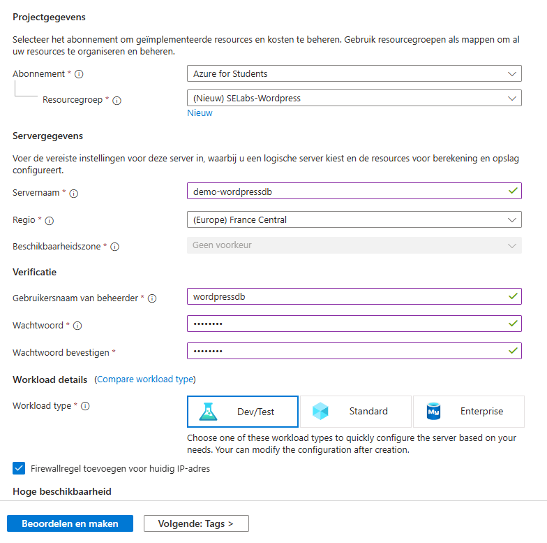

Klik vervolgens op `Beoordelen en maken`. Je hoeft niets aan te passen op het tabblad `Tags`.

Je krijgt een overzicht van de ingevulde/aangepaste gegevens over deze databankserver:


Klik op `Maken`. De databankserver wordt opgezet en duurt enige tijd. Na afloop zie je een bericht verschijnen met `Implementatie voltooid`.

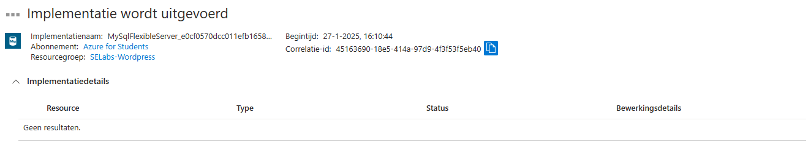

> ⚠️ **Let op:** Krijg je een foutmelding die vertelt dat provisioning niet beschikbaar is in de geselecteerde regio? Kies dan een andere regio uit de lijst en probeer opnieuw. Het aantal resources voor het Azure for Students wordt beperkt aangeboden en het kan dus zijn dat niet alle regio's beschikbaar zijn.
>
> Mocht het na meerdere regio's te proberen nog steeds niet lukken, dan kan je, na goedkeuring van jouw begeleider, ook deze tutorial proberen: <https://learn.microsoft.com/en-us/azure/app-service/quickstart-wordpress>. Hierbij wordt een kant-en-klare WordPress server opgezet. Kies hierbij voor het gratis hosting plan. Na de installatie moet je wel alle geïnstalleerde plugins verwijderen, deze zorgen ervoor dat de Wordpress website niet soepel werkt.

De machine is nu ook zichtbaar in de Resourcegroep `SELabs-Wordpress`. (💡 **Tip:** via de Azure portal startpagina kan je eenvoudig naar de recente resources navigeren.)

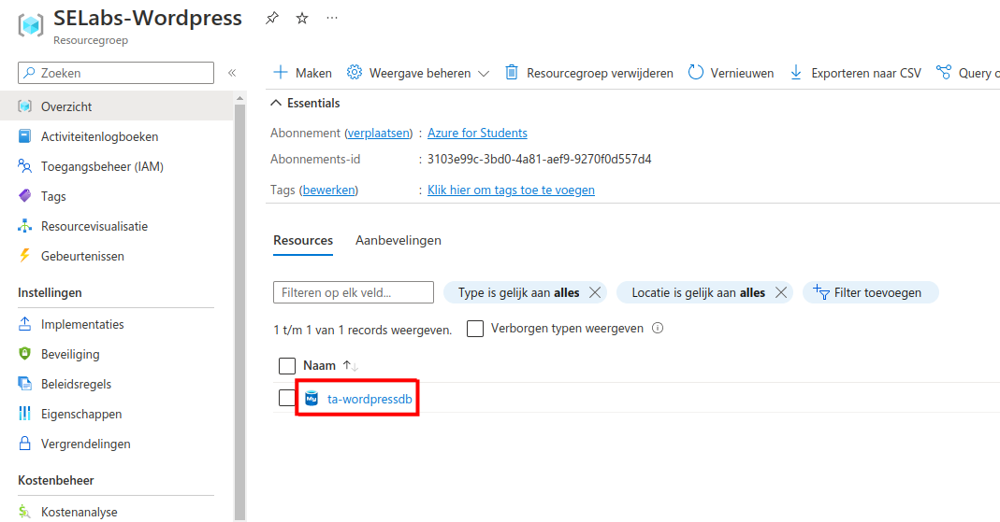

### Stap 3 - Ubuntu applicatieserver opzetten

Keer terug naar de Azure portal startpagina en klik op `Een resource aanmaken`. Zoek `Ubuntu Server 22.04 LTS` in de Marketplace en klik op het resultaat met dezelfde naam.


Klik vervolgens op `Maken`. Vul op het tabblad `Basisinformatie` de volgende gegevens in:

- Resourcegroep: selecteer `SELabs-Wordpress` (= de eerder aangemaakte groep)
- Naam van de virtuele machine: zelf te kiezen (hou dit bij in de overzichtstabel)
- Regio: `(Europe) France Central`
- Beveiligingstype: `Standaard`
- Grootte: kies `B1s` met 1 vCPU en 1 GiB RAM (**let op:** er zijn twee versies van dit type) via `Alle grootten weergeven`
- Verificatietype: selecteer `Wachtwoord` (In de praktijk zal je echter gebruik maken van SSH keys om je virtuele machines te beheren. Dit is echter niet in de scope van deze opdracht. Je mag dit zeker uitproberen als extra.)
- Gebruikersnaam: zelf te kiezen (hou dit bij in de overzichtstabel)
- Wachtwoord: zelf te kiezen (hou dit bij in de overzichtstabel)
- Regels voor binnenkomende poort: in het lijstje selecteer je `HTTP (80)`, `HTTPS (443)` en `SSH (22)`
- Klik op `Volgende: Schijven`

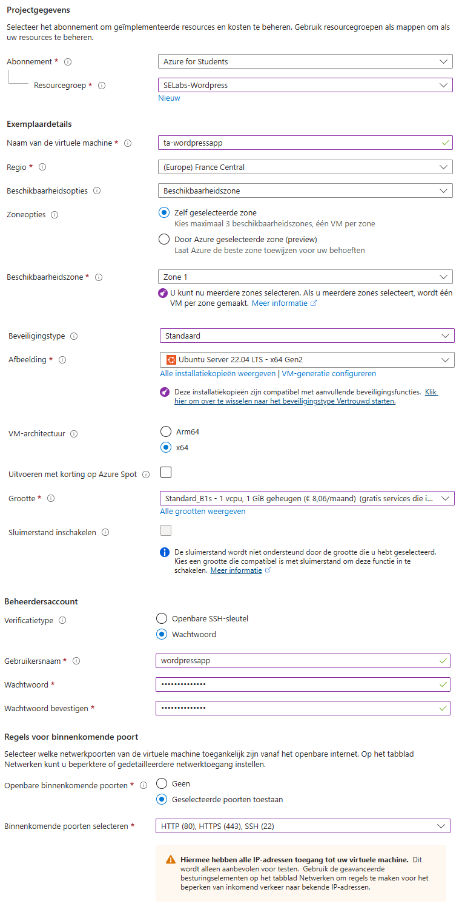

Vervolgens selecteer je op het tabblad `Schijven` de volgende instellingen:

- Type besturingssysteemschijf: selecteer `Standard - SSD (lokaal redundante opslag)`
- Klik op `Volgende: Netwerken`

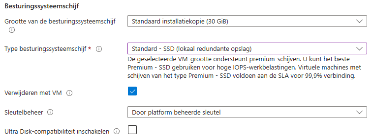

Op het tabblad `Netwerken` controleer je of `HTTP (80)` en `HTTPS (443)` in het lijstje staan bij `Binnenkomende poorten selecteren`.


Klik vervolgens op `Volgende: Beheer`. Daar vul je de volgende gegevens in:

- Activeer `Automatisch afsluiten inschakelen` en pas de tijd (bv. 23u59) en tijdszone (bv. Brussel) aan.
- Vink eventueel `Melding voor afsluiten` aan of uit, naar eigen voorkeur.
- Klik op `Beoordelen en maken` (we hoeven verder niets aan te passen bij `Monitoring`, `Geavanceerd` en `Tags`).

Je krijgt een overzicht van de ingevulde/aangepaste gegevens over deze applicatieserver, klik hier op `Maken`.

De applicatieserver wordt nu opgezet, dit duurt enige tijd. Na afloop zie je een bericht verschijnen met `Implementatie voltooid` en komen de resources voor deze machine in de Resourcegroep `SELabs-Wordpress` terecht.

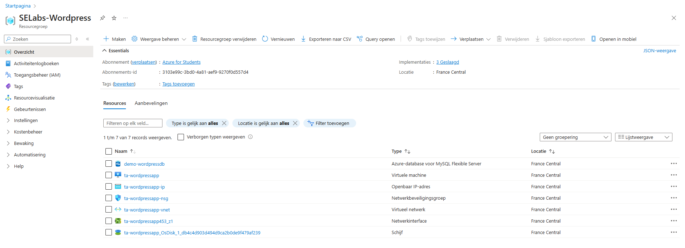

### Stap 4 - Aangemaakte applicatie- en databankserver verkennen en de configuratie ervan finaliseren

#### Info van de machine opvragen en instellingen doorvoeren

Een overzicht van de reeds aangemaakte resources vind je altijd terug in de Resourcegroep `SELabs-Wordpress`, te bereiken via de Azure portal startpagina. Je kan hiervoor bovenaan op `Resourcegroepen` klikken waarna je op `SELabs-Wordpress` klikt, maar de kans is groot dat je rechtstreeks naar de groep kan navigeren via `Recente resources`.


Binnen de resourcegroep kan je naar de eigenschappen en instellingen van de machines navigeren door op de naam van de machine te klikken.

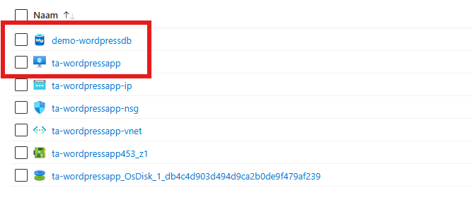

Het resultaat is een overzicht van de machine met verdere instelmogelijkheden (voornamelijk te bereiken via het linkermenu). Deze info is nuttig om met de machines aan de slag te gaan. Zo ziet de overzichtspagina van de databankserver er bijvoorbeeld uit:

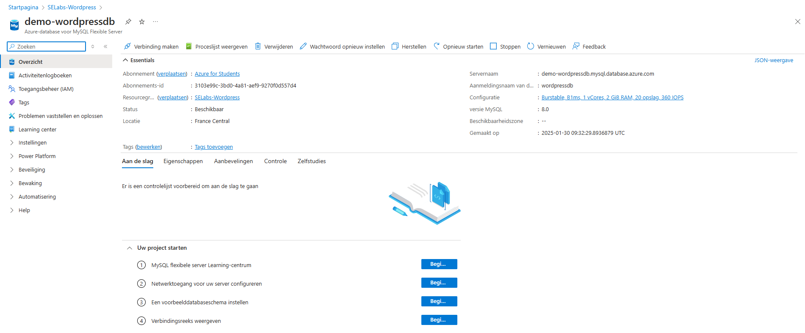

Als voorbereiding op de installatie van onze WordPress applicatie moeten er nog een aantal configuraties gebeuren.

#### Applicatieserver: DNS configureren

Ga naar de overzichtspagina van de applicatieserver en klik bij DNS-naam op `Niet geconfigureerd`.

Hierbij krijg je meteen een statische toewijzing voor het IP-adres en moet je enkel nog een DNS-naamlabel opgeven. Je kan als naamlabel best de naam van de machine gebruiken. Bewaar de instellingen door bovenaan op de knop `Opslaan` te klikken.


Keer terug naar het overzicht van de applicatieserver via het pad bovenaan (Startpagina > ...) door op de naam van je applicatieserver te klikken.

Je ziet een mooie DNS-naam verschijnen alsook het publiek IP-adres dat je later nog nodig hebt. Vanaf nu is de machine via deze DNS-naam te bereiken, bijvoorbeeld met SSH dat we straks nodig hebben voor de installatie van de WordPress app. Probeer dit alvast even uit met onderstaand commando! Vervang alle placeholders tussen `<` en `>` door de juiste waarden.

```console
ssh <gebruikersnaam>@<dns-naam>
```

Dit zou er bijvoorbeeld als volgt kunnen uitzien:


#### Databankserver: toegang tot MySQL configureren

Maak een SSH-verbinding met de applicatieserver (indien je dit nog niet had gedaan na de DNS-naam configuratie).

Haal eerst de laatste informatie van de package repositories op met volgend commando:

```shell
sudo apt update
```

Voer de updates uit (veelal gaat het om security updates):

```shell
sudo apt upgrade
```

(Bevestig in het dialoogvenster met `Yes`.)

Installeer vervolgens de MySQL Client met volgend commando:

```shell
sudo apt install mysql-client
```

(Bevestig in het dialoogvenster met `Yes`.)

Probeer een verbinding te maken met MySQL op de databankserver met commando (noot: de hostnaam en aanmeldingsnaam vind je ook terug op de overzichtspagina van de databankserver in Azure):

```shell
mysql -h <host> -u <user> -p
```

Je merkt dat er weinig gebeurt na het ingeven van je wachtwoord. Na een tijdje krijg je onderstaande melding die aangeeft dat de server niet bereikbaar is.

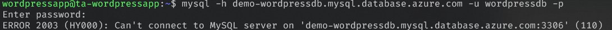

Ga in Azure naar de overzichtspagina van de databankserver en klik in het linkermenu op `Netwerken`.

We voegen een nieuwe firewallregel toe met het publiek IP-adres van onze applicatieserver als begin- en eind-IP-adres (te vinden op de overzichtspagina van de applicatieserver) en bewaar deze configuratie door bovenaan op de knop `Opslaan` te klikken.

Met deze configuratie zorgen we ervoor dat enkel onze applicatieserver toegang kan krijgen tot onze databank. Merk op dat er ook een beveiligde SSL-verbinding met onze databank afgedwongen zal worden. Dit zullen we later ook duidelijk moeten maken aan onze WordPress applicatie!


Probeer de verbinding met de MySQL databank opnieuw uit en je zal zien dat deze nu toegankelijk is vanaf de applicatieserver. Met het commando `exit` verbreek je de verbinding.

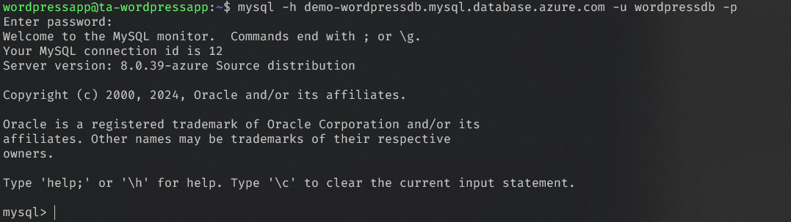

### Stap 5 - WordPressapplicatie installeren

In de stappen 2 en 3 hebben we de benodigde machines opgezet: een Ubuntu applicatieserver en een MySQL databankserver. Door de configuraties in stap 4 werkt de verbinding tussen de applicatieserver en de MySQL databankserver. Nu is het tijd om de WordPress webapplicatie te installeren op de applicatieserver, die gebruik zal maken van de MySQL databank.

Maak een SSH-verbinding met je applicatieserver (zoals eerder uitgeprobeerd). Ga naar <https://ubuntu.com/tutorials/install-and-configure-wordpress#1-overview> en volg de tutorial om WordPress te installeren. Zorg ervoor dat je begrijpt wat elke stap en elk commando doet en waarom dit nodig is. In de praktijk kan een tutorial niet altijd 1-op-1 gevolgd worden, dus het is belangrijk om te weten wat er gebeurt. Houd rekening met de volgende zaken:

- **2. Install dependencies**

  - Laat bij de `apt install` instructie `mysql-server` weg, aangezien we al een aparte databankserver hebben opgezet.

- **4. Configure Apache for WordPress**

  - 💡 **Tip:** gebruik een teksteditor (bv. `nano` of `vim`) om het bestand `wordpress.conf` aan te maken en de configuratie in te plakken.
  - Het gebruik van `sudo` kan nodig zijn. Gebruik het echter niet zomaar overal, alleen waar nodig.
  - De configuratie van de hostname mag je overslaan.
  - In deze stap maak je een bestand in de map `/etc/apache2/sites-available`. In de configuratiemap van Apache is er ook een map `/etc/apache2/sites-enabled`.
    **:question: Wat is het verschil tussen beide?**
  - Gebruik `sudo systemctl reload apache2` in plaats van `sudo service apache2 reload`.
    **:question: Wat is het verschil tussen beide? Waarom kiezen we voor `systemctl`?**

- **5. Configure database**

  - Vergeet niet dat de MySQL databank niet op deze applicatieserver draait. Zie eerder hoe je een verbinding maakt met de databank vanaf de applicatieserver! Ook het laatste commando om MySQL op te starten is niet van toepassing.
  - Kies een wachtwoord (bewaar dit in de overzichtstabel). In plaats van localhost gebruik je `'%'` zodat aanmelden lukt vanaf elke host en niet alleen lokaal. Voer de volgende commando's achtereenvolgens uit:

  ```sql
  mysql> CREATE DATABASE wordpress;
  mysql> CREATE USER 'wordpress'@'%' IDENTIFIED BY 'wordpresspwd';
  mysql> GRANT SELECT,INSERT,UPDATE,DELETE,CREATE,DROP,ALTER ON wordpress.* TO 'wordpress'@'%';
  mysql> FLUSH PRIVILEGES;
  mysql> QUIT;
  ```

- **6. Configure WordPress to connect to the database**

  - Vergeet niet om het wachtwoord uit stap 5 te gebruiken.
  - Je hoeft de `sed` commando's niet te gebruiken. Je kan ook met een teksteditor de nodige aanpassingen doen in het configuratiebestand, zoals bijvoorbeeld:

  ```shell
  sudo -u www-data nano /srv/www/wordpress/wp-config.php
  ```

  **:question: Wat is de betekenis van `sudo -u www-data` in dit commando?**

  - Bij het openen van het configuratiebestand ga je naast de opgegeven instructies ook zoeken naar de regel voor `DB_HOST`. Voer nu uiteraard de DNS-naam van de databankserver in plaats van `localhost` in! (Herinnering: bepaalde gegevens zijn terug te vinden op de overzichtspagina's van de machines in Azure.)

  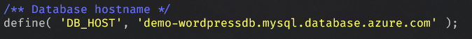

- **7. Configure WordPress**

  - Het is nu tijd om WordPress te configureren.
  - Surf hiervoor naar de DNS-naam van jouw applicatieserver (in plaats van `localhost`).
  - Helaas krijgen we een foutmelding die aangeeft dat een verbinding met de database niet lukt.

  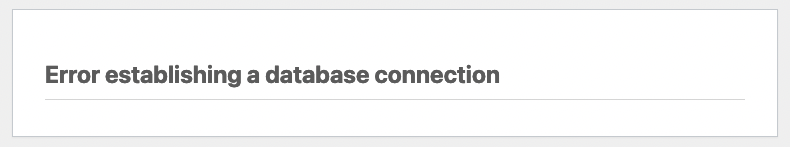

  - _Optioneel:_ Indien je de foutmelding in detail wil zien, dan kan je de `WP_DEBUG` optie in het configuratiebestand van WordPress activeren. Dit doe je door in `/srv/www/wordpress/wp-config.php` de variabele `WP_DEBUG` op `true` te zetten:

  ```shell
  define('WP_DEBUG', true);
  ```

  - Herinner je nog dat onze verbinding met de databank via een beveiligde SSL-verbinding moet verlopen? Je moet dit nog duidelijk maken aan WordPress! Open hiervoor opnieuw het configuratiebestand van WordPress.

  ```shell
  sudo -u www-data nano /srv/www/wordpress/wp-config.php
  ```

  - Voeg `define('MYSQL_CLIENT_FLAGS', MYSQLI_CLIENT_SSL);` toe aan het bestand, tussen `/* Add any custom values between this line and the "stop editing" line. */` en `/* That's all, stop editing! Happy publishing. */` en bewaar het bestand.

  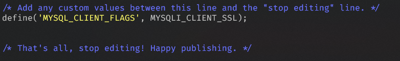

  - Probeer opnieuw te surfen naar de WordPress applicatie. Als alles goed is verlopen, kan je nu WordPress configureren. Volg de instructies en houd je gebruikersnaam en wachtwoord voor je blog goed bij. Let's go!

  - Jouw mooie blog is nu klaar en je kan na het inloggen meteen een eerste bericht plaatsen!

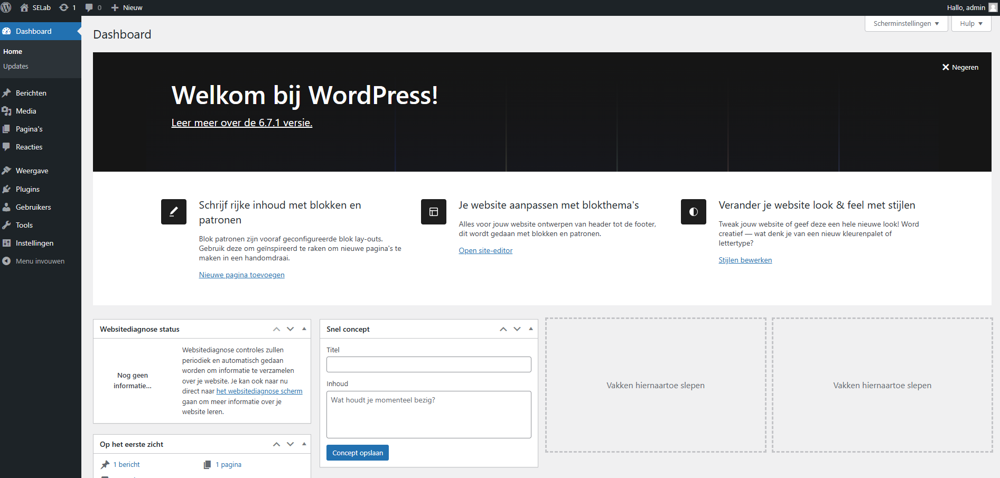

> :bulb: **Tip:** werkt jouw Wordpress blog nog niet zoals verwacht? Misschien vind je hier wel een manier om het probleem op te sporen: <https://developer.wordpress.org/advanced-administration/debug/debug-wordpress/>. Check ook de logs van Apache op de applicatieserver.

### Stap 6 - Beveiliging toepassen

Wie goed heeft opgelet, ziet dat de verbinding met de WordPress-blog nog niet beveiligd is met HTTPS. In de huidige tijd kunnen we ons dit niet meer permitteren. Elke verbinding moet beveiligd worden met behulp van encryptie om de uitwisseling van gegevens onleesbaar te maken voor potentiële hackers.

Gelukkig kunnen we bij [Let's Encrypt](https://letsencrypt.org/) een certificaat ophalen om een beveiligde HTTPS-verbinding op te zetten, en kan certbot ons helpen om dit allemaal te automatiseren.

Surf naar <https://certbot.eff.org/instructions?ws=apache&os=ubuntufocal>. Volg de instructies waarbij je rekening houdt met de volgende zaken:

- **Stap 1:** je hebt waarschijnlijk nog een SSH-verbinding met de applicatieserver, waardoor deze stap niet nodig is.
- **Stap 2:** niet nodig om uit te voeren aangezien `snapd` al op onze Ubuntu-machine aanwezig is.
- **Stap 3:** niet nodig om uit te voeren aangezien er nog geen certbot aanwezig is op de Ubuntu-machine.
- **Stap 6:** kies de eerste optie zodat het certificaat ook meteen op de Apache-webserver geconfigureerd is! Volg de instructies en geef gepaste antwoorden. De domeinnaam ken je; dat is de DNS-naam van je applicatieserver die je ook gebruikt om naar je blog te surfen.

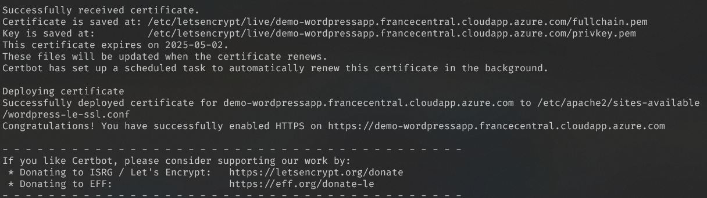

- Jouw mooie blog is nu veilig toegankelijk via HTTPS door middel van een Let's Encrypt-certificaat. Proficiat!

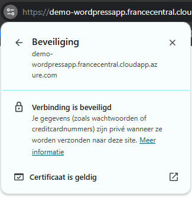

### Stap 7 - Machines uitschakelen

Je kreeg via het studentenaanbod van Azure een beperkt krediet van $100 om te besteden. Machines laten draaien kost geld. **Als je er even niet op werkt, schakel je de machines dus best uit!**

Ga hiervoor naar de overzichtspagina's van je machines in Azure en klik bovenaan op `Stoppen`. De status van de machines moet veranderen naar `Gestopt`.

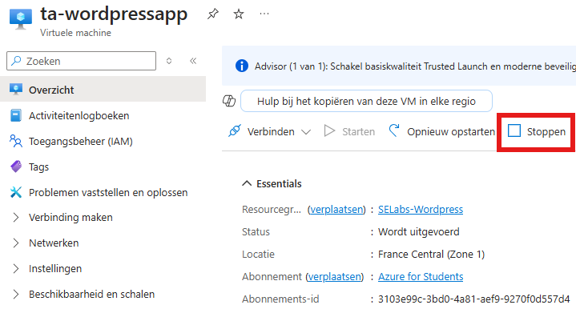

:exclamation: **Let op:** de machines starten na 30 dagen zonder melding opnieuw op. Na het demonstreren verwijder je alle resources door de resourcegroep te verwijderen. Dit kan je doen door op de resourcegroep te klikken en vervolgens op `Resourcegroep verwijderen` te klikken.

## :rocket: Mogelijke uitbreidingen

- Configureer de virtuele machine zodat je kan aanmelden met een SSH-sleutel.
- Installeer een ander thema voor je WordPress-blog.
- Maak een script voor de installatie van de WordPress-blog.
- Voer extra beveiligingsmaatregelen door op de virtuele machine (bv. `fail2ban`).
- Zorg ervoor dat de WordPress-blog bereikbaar is via een eigen domeinnaam.
  - 💡 Tip: via het [GitHub Student Developer Pack](https://education.github.com/pack) kan je gratis domeinnamen registreren bij een aantal aanbieders.
  - Zorg er ook voor dat het certificaat van Let's Encrypt opnieuw wordt aangevraagd en geïnstalleerd voor de nieuwe domeinnaam.
- Kies een service van de [awesome-selfhosted list](https://github.com/awesome-selfhosted/awesome-selfhosted) en installeer deze op een virtuele machine in Azure.
  - Zorg ervoor dat alle services (ook WordPress) bereikbaar zijn via een domeinnaam en dat de verbinding beveiligd is met een certificaat van Let's Encrypt.
