# Opdracht 4 - WordPress opzetten in de Microsoft Azure cloudomgeving

In deze opdracht zal je proeven van de mogelijkheden binnen de Microsoft Azure cloudomgeving. Je zal hiervoor een account maken op Azure, een applicatie- en databankserver opzetten en de WordPress webapplicatie installeren en configureren. Uiteraard zorg je ervoor dat de verbindingen tussen de systemen en met de webapplicatie veilig verlopen.

## :mortar_board: Leerdoelen

- Je kan een account aanmaken op een cloudplatform.
- Je kan een applicatie- en databankserver opzetten in een cloudomgeving.
- Je kan een webapplicatie installeren en configureren in een cloudomgeving.
- Je kan een beveiligde verbinding opzetten met een webapplicatie in een cloudomgeving.
- Je kan een beveiligde verbinding opzetten tussen servers in een cloudomgeving.

## :memo: Evaluatiecriteria

Toon na afwerken het resultaat aan je begeleider. Elk teamlid moet in staat zijn om het resultaat te demonstreren bij de oplevering van deze opdracht! Criteria voor beoordeling:

- [ ] Je kan de aangemaakte machines tonen in de Azure omgeving.
- [ ] Het lukt om een SSH-verbinding op te zetten met de applicatieserver.
- [ ] Het lukt om aan te melden op MySQL op de databankserver vanaf de applicatieserver.
- [ ] Je kan met HTTPS surfen naar jouw WordPress blog.
- [ ] Je kan kan aanmelden en het WordPress dashboard tonen.
- [ ] Je kan een nieuw bericht posten op jouw WordPress blog.
- [ ] Je hebt een verslag gemaakt op basis van het template.
- [ ] De cheat sheet werd aangevuld met nuttige commando's die je wenst te onthouden voor later.

## Probleemstelling

Met VirtualBox kan je virtuele machines aanmaken in een testomgeving die niet meteen publiek toegankelijk zijn. Je zal dus een oplossing nodig hebben om ook zaken in productie te plaatsen waarbij je let op voldoende capaciteit, performantie, veiligheid...

Uiteraard kan je als productieomgeving voor een eigen datacenter kiezen. Dat is echter bijhoorlijk kostelijk om in eigen beheer op te zetten. Denk maar aan de nodige netwerkapparatuur, servers, internetverbinding met voldoende bandbreedte, koeling... Ook het dagelijks onderhoud van een datacenter kost veel tijd en geld.

Gelukkig bestaan er reeds grote, wereldwijde datacenters die we cloudplatformen kunnen noemen. Een aantal grote spelers zoals Amazon, Google, Microsoft... bieden die aan onder namen als [Amazon AWS](https://aws.amazon.com/), [Google Cloud](https://cloud.google.com/), [Microsoft Azure](https://azure.microsoft.com)... Het gebruik van een cloudplatform is het overwegen waard om zaken in productie te plaatsen waarbij je de kosten afweegt t.o.v. de kosten voor een datacenter in eigen beheer.

Het doel van deze opdracht is om het cloudplatform van Microsoft, nl. [Azure](https://azure.microsoft.com), te verkennen. Hiervoor zal je volgende machines opzetten:

- een Ubuntu applicatieserver waarop je WordPress installeert;
- een databankserver met de MySQL databank.

Aangezien je de WordPress webapplicatie publiek toegankelijk zal maken, moet je ook zorgen voor de nodige beveiliging, zowel tussen de servers onderling als bij de toegang tot de webapplicatie.

Probeer de stappen om tot een resultaat te komen te begrijpen, nauwgezet op te volgen en uit te voeren. En zoals steeds, geduld is een mooie deugd met de nodige volharding om eventuele problemen onderweg aan te pakken.

Veel succes!

## Opdracht

### Overzicht machinenamen, accounts en wachtwoorden

Tijdens deze opdracht zullen heel wat machinenamen, gebruikersnamen en wachtwoorden de revue passeren. Om het overzicht te bewaren, vind je hieronder een voorbeeld voor een overzicht van de machinenamen, gebruikersnamen en wachtwoorden die je nodig hebt. De huidige inhoud is bij wijze van voorbeeld. **Maak zelf een Markdown-bestand met deze tabel en pas deze aan met je eigen gegevens.**

:bulb: **Opmerking:** In de praktijk houd je deze typisch bij in een wachtwoordkluis. Heb je reeds een wachtwoordkluis? Maak hier dan gerust gebruik van.

:exclamation: **Let op:** als je deze opdracht verspreid over verschillende dagen maakt, schakel dan steeds alle machines uit om kosten te vermijden. Je kan de machines later terug opstarten. Na 30 dagen worden de machines automatisch opgestart.

| **Variabele**                    | **Inhoud**                                                                                                                |
| -------------------------------- | ------------------------------------------------------------------------------------------------------------------------- |
| Resourcegroep                    | SELabs-Wordpress                                                                                                          |
| Naam databankserver              | \<initialen\>-wordpressdb (bv. "or-wordpressdb")                                                                          |
| DNS-naam databankserver          | bv. "or-wordpressdb.mysql.database.azure.com"<br />(terug te vinden op de overzichtspagina van de machine in Azure)       |
| Beheerder databankserver         | wordpressdb                                                                                                               |
| Wachtwoord databankserver        | \*\*\*\*\* (bv.  "LetmeIn!")                                                                                              |
| Naam applicatieserver (Ubuntu)   | bv. "or-wordpressapp"                                                                                                     |
| DNS-naam applicatieserver        | bv. "or-wordpressapp.westeurope.cloudapp.azure.com"<br />(terug te vinden op de overzichtspagina van de machine in Azure) |
| Gebruikersnaam applicatieserver  | wordpressapp                                                                                                              |
| Wachtwoord applicatieserver      | \*\*\*\*\* (bv.  "LetmeIntheApp!")                                                                                        |
| WordPress db user                | bv. "wordpress"                                                                                                           |
| Wachtwoord van WordPress db user | bv.  "wordpresspwd"                                                                                                       |
| WordPress user                   | admin                                                                                                                     |
| WordPress user password          | Srro@H%E@1iKllIZUj  (gegenereerd)                                                                                         |

### Stap 1 - Microsoft Azure account aanmaken

Microsoft Azure is natuurlijk niet gratis. Gelukkig bestaat er een gratis versie voor studenten. Deze gratis versie is echter beperkt in krediet, in tijd en in functionaliteit. Je kan deze gratis versie echter wel gebruiken om de opdracht uit te voeren.

Ga via Chamilo (beginscherm) naar Academic Software en zoek daar **Azure Dev Tools for Teaching**. Volg de stappen om een account aan te maken. Je kan ook rechstreeks surfen naar <https://azureforeducation.microsoft.com/devtools>.

Meld je aan met je HOGENT-account en volg de instructies. Na activatie van jouw Azure account, komt je terecht op Azure Education Hub.

|  |
| :---------------------------------------------------------------------: |
|                  Figuur 1. Dashboard Azure education.                   |

### Stap 2 - MySQL databankserver opzetten

In deze stap zullen we een MySQL databankserver opzetten in Azure. Deze server zal de databank bevatten waarin de gegevens van de WordPress webapplicatie worden opgeslagen.

Klik bovenaan links op `Microsoft Azure` of `Startpagina`. Klik op `Een resource maken`.

| 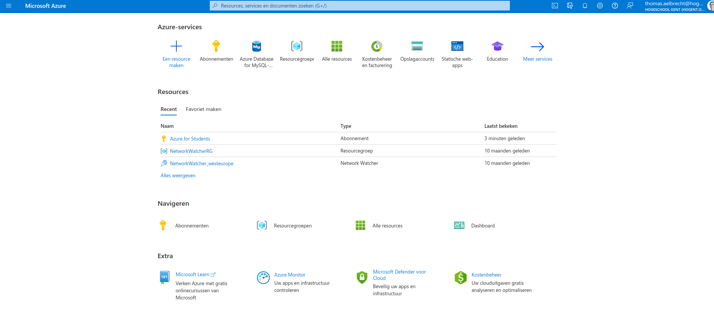 |
| :---------------------------------------------------------: |
|                Figuur 2. Azure portal home.                 |

Selecteer `Azure Database for MySQL` bij `Databases` (of zoek deze via het veld `Services en marketplace doorzoeken`).

|  |
| :---------------------------------------------------------------------------: |
|             Figuur 3. Overzicht beschikbare databanken in Azure.              |

We weten dat hier een optie staat om een kant-en-klare WordPress server op te zetten. We gaan echter zelf aan de slag met de onderdelen. Er zijn tegenwoordig heel wat cloudservices beschikbaar die veel "magie" van je overnemen. Het is echter belangrijk om te weten wat er achter de schermen gebeurt. Zo heb je nog steeds controle over wat er wel of niet gebeurt/nodig is.

Klik bij `Flexibele server` op `Maken`. In het tabblad `Basis` vul je de volgende gegevens in:

- Abonnement: `Azure voor studenten`
- Maak een nieuwe Resourcegroep aan met de naam `SELabs-Wordpress`
- Servernaam: zelf te kiezen (hou dit bij in de overzichtstabel)
- Locatie: `West Europe`
- Versie: laatste versie (8.0)
- Workloadtype: `Voor ontwikkelings- of hobbyprojecten`

|  |
| :--------------------------------------------------------------------------------------------------------: |
|                     Figuur 4. Overzicht basisinstellingen voor MySQL server in Azure.                      |

- Berekening en opslag: kies voor `Server configureren` en pas onderstaande instellingen aan:
  - Berekeningslaag: `Met burstmogelijkheden (1-20 vCores): meest geschikt voor workloads waarvoor niet continu de volledige CPU hoeft te worden gebruikt`
  - Grootte berekening: `Standaard_B1s (1 vCore, 1 GiB RAM, 400 maximale iops)`
  - IOPS: `Vooraf ingerichte IOPS`
  - Verder de standaard instellingen laten staan.
  - Klik op `Opslaan`

| 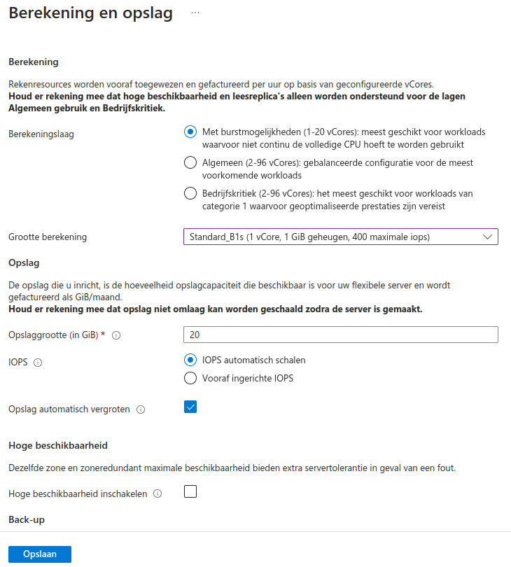 |
| :-------------------------------------------------------: |
|                Figuur 5. Database storage.                |

- Verficatiemethod: `alleen verificatie MySQL`
- Gebruikersnaam van beheerder: zelf te kiezen (hou dit bij in de overzichtstabel)
- Wachtwoord: zelf te kiezen (hou dit bij in de overzichtstabel)

| 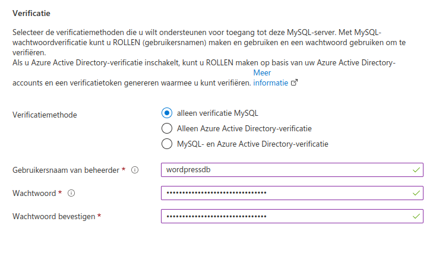 |
| :-----------------------------------------------------------------------------------------------: |
|               Figuur 6. Overzicht authenticatiemethode voor MySQL server in Azure.                |

Klik daarna op `Volgende: Netwerken`. In het tabblad `Netwerken` vul je de volgende gegevens in:

- Verbindingsmethode: `Openbare toegang (toegestane IP-adressen)`
- Firewallregels: klik op `Huidig IP-adres (x.x.x.x) van client toevoegen`
  - Pas eventueel de naam van de firewallregel aan
  - Deze stap is niet verplicht, maar dan zal je geen toegang hebben tot de MySQL databank vanop je eigen toestel.

|  |
| :-------------------------------------------------------------------------------------------------: |
|                 Figuur 7. Overzicht netwerkinstellingen voor MySQL server in Azure.                 |

Klik vervolgens op `Beoordelen en maken`. Je hoeft niets aan te passen op de tabbladen `Beveiliging` en `Tags`.

Je krijgt een overzicht van de ingevulde/aangepaste gegevens over deze databankserver:

| 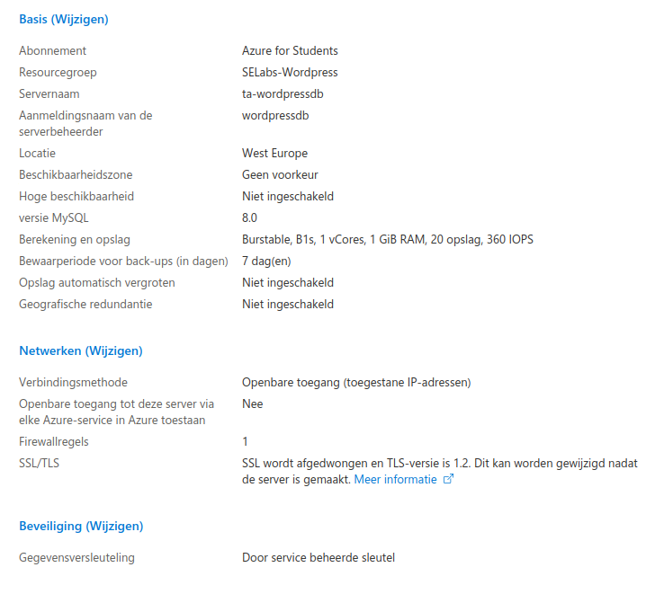 |
| :-----------------------------------------------------------------------------------------------------: |
|                  Figuur 8. Overzicht instellingen voor aanmaken MySQL server in Azure.                  |

Klik op `Maken`. De databankserver wordt opgezet en duurt enige tijd. Na afloop zie je een bericht verschijnen met `Implementatie voltooid`.

| 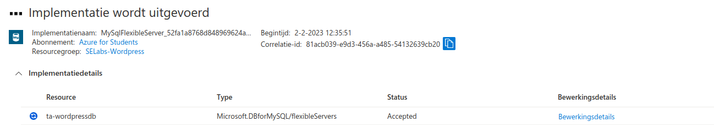 |
| :----------------------------------------------------------------------: |
|                  Figuur 9. Implementatie in uitvoering.                  |

De machine is nu ook zichtbaar in de Resourcegroep `SELabs-Wordpress`. (:bulb: **Tip:** via de Azure portal startpagina kan je eenvoudig naar de recente resources navigeren.)

|  |
| :------------------------------------------------------------------------------------: |
|                      Figuur 10. Resourcegroup na opzetten MySQL.                       |

### Stap 3 - Ubuntu applicatieserver opzetten

Keer terug naar de Azure portal startpagina en klik op `Een resource aanmaken`. Zoek `Ubuntu Server 22.04 LTS` in de Marketplace en klik op het resultaat met dezelfde naam.

|  |
| :------------------------------------------------------------------: |
|                  Figuur 11. Marketplace Ubuntu LTS.                  |

Klik vervolgens op `Maken`. Vul op het tabblad `Basisinformatie` de volgende gegevens in:

- Resourcegroep: selecteer `SELabs-Wordpress` (= de eerder aangemaakte groep)
- Naam van de virtuele machine: zelf te kiezen (hou dit bij in de overzichtstabel)
- Regio: `(Europe) West Europe`
- Beveiligingstype: `Standaard`
- Grootte: kies `B1s` met 1 vCPU en 1 GiB RAM (**let op:** er zijn twee versies van dit type) via `Alle grootten weergeven`
- Verificatietype: selecteer `Wachtwoord` (In de praktijk zal je echter gebruik maken van SSH keys om je virtuele machines te beheren. Dit is echter niet in de scope van deze opdracht. Je mag dit zeker uitproberen als extra.)
- Gebruikersnaam: zelf te kiezen (hou dit bij in de overzichtstabel)
- Wachtwoord: zelf te kiezen (hou dit bij in de overzichtstabel)
- Regels voor binnenkomende poort: in het lijstje selecteer je `HTTP (80)`, `HTTPS (443)` en `SSH (22)`
- Klik op `Volgende: Schijven`

|  |
| :------------------------------------------------------------------------------------------------: |
|                Figuur 12. Overzicht basisinstellingen voor Ubuntu server in Azure.                 |

Vervolgens selecteer je op het tabblad `Schijven` volgende instellingen:

- Type besturingssysteemschijf: selecteer `Standard - SSD (lokaal redundante opslag)`
- Klik op `Volgende: Netwerken`

| 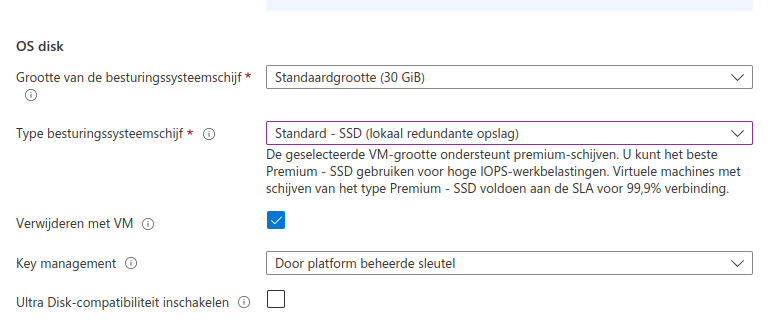 |
| :------------------------------------------------------------------------------------------------------: |
|                   Figuur 13. Overzicht schijfinstellingen voor Ubuntu server in Azure.                   |

Op het tabblad `Netwerken` controller je of `HTTP (80)` en `HTTPS (443)` in het lijstje staan bij `Binnenkomende poorten selecteren`.

|  |
| :----------------------------------------------------------------------------------------------------------: |
|                    Figuur 14. Overzicht netwerkinstellingen voor Ubuntu server in Azure.                     |

Klik vervolgens op `Volgende: Beheer`. Daar vul je volgende gegevens in:

- Activeer `Automatisch afsluiten inschakelen` en pas de tijd (bv. 23u59) en tijdszone (bv. Brussel) aan.
- Vink eventueel `Melding voor afsluiten` aan of uit, naar eigen voorkeur.
- Klik op `Beoordelen en maken` (we hoeven verder niets aan te passen bij `Monitoring`, `Geavanceerd` en `Tags`).

Je krijgt een overzicht van de ingevulde/aangepaste gegevens over deze applicatieserver, klik hier op `Maken`.

De applicatieserver wordt opgezet en duurt enige tijd. Na afloop zie je een bericht verschijnen met `Implementatie voltooid` en komen de resources voor deze machine in de Resourcegroep `SELabs-Wordpress` terecht.

|  |
| :-----------------------------------------------------------------------------------: |
|                     Figuur 15. Resourcegroup na opzetten Ubuntu.                      |

### Stap 4 - Aangemaakte applicatie- en databankserver verkennen en de configuratie ervan finaliseren

#### Info van de machine opvragen en instellingen doorvoeren

Een overzicht van de reeds aangemaakte resources kan je steeds terugvinden in de Resourcegroep `SELabs-Wordpress`, te bereiken via de Azure portal startpagina. Je kan hiervoor bovenaan op  `Resourcegroepen` klikken waarna je op `SELabs-Wordpress` klikt maar de kans is groot dat je rechtstreeks naar de groep kan navigeren via `Recente resources`.

| 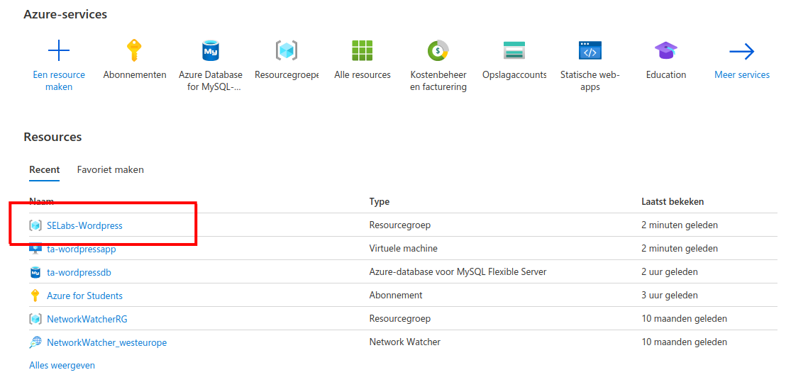 |
| :----------------------------------------------------------: |
|                 Figuur 16.Recent resources.                  |

Binnen de resourcegroep kan je naar de eigenschappen en instellingen van de machines navigeren door op de naam van de machine te klikken.

| 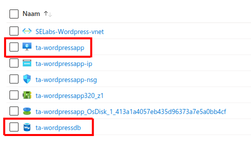 |
| :----------------------------------------------------: |
|               Figuur 17. Resourcegroup.                |

Het resultaat is een overzicht van de machine met verdere instelmogelijkheden (voornamelijk te bereiken via het linkermenu). Deze info is nuttig om met de machines aan de slag te gaan. Zo ziet de overzichtspagina van de databankserver er bijvoorbeeld uit:

|  |
| :-------------------------------------------------------------------: |
|                 Figuur 18. Overzicht databankserver.                  |

Als voorbereiding op de installatie van onze WordPress applicatie moeten er nog een aantal configuraties gebeuren.

#### Applicatieserver: DNS configureren

Ga naar de overzichtspagina van de applicatieserver en klik bij DNS-naam op `Niet geconfigureerd`.

Hierbij krijg je meteen een statische toewijzing voor het IP-adres en moet je enkel nog een DNS-naamlabel opgeven. Bewaar de instellingen door bovenaan op de knop `Opslaan` te klikken. (Je kan als naamlabel best de naam van de machine gebruiken.)

|  |
| :-----------------------------------------------: |
|              Figuur 19. Statisch ip.              |

Keer terug naar het overzicht van de applicatieserver via het pad bovenaan (Startpagina > ...) door op de naam van je applicatieserver te klikken.

Je ziet een mooie DNS-naam verschijnen alsook het publiek IP-adres dat je later nog nodig hebt. Vanaf nu is de machine via deze DNS-naam te bereiken zoals bijvoorbeeld met SSH dat we straks nodig hebben voor de installatie van de WordPress app. Probeer dit alvast even uit met onderstaand commando! Vervang alle placeholders tussen `<` en `>` door de juiste waarden.

```console
ssh <gebruikersnaam>@<dns-naam>
```

Dit zou er bijvoorbeeld als volgt kunnen uitzien:

| 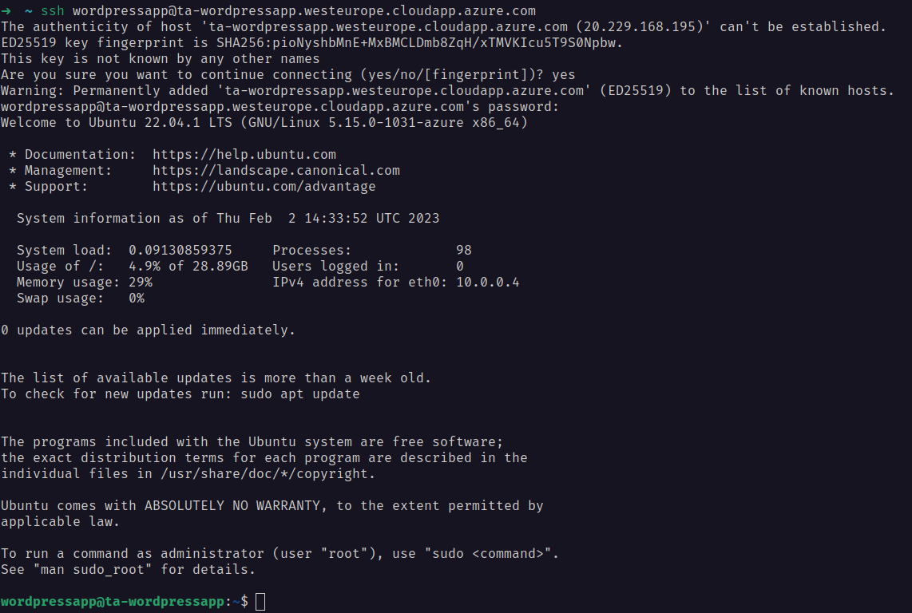 |
| :--------------------------------------------------: |
|              Figuur 20. SSH verbinding.              |

#### Databankserver: toegang tot MySQL configureren

Maak een SSH-verbinding met de applicatieserver (indien je dit nog niet had gedaan na de DNS-naam configuratie).

Haal eerst de laatste informatie van de package repositories op met volgend commando:

```shell
sudo apt update
```

Voer de updates uit (veelal gaat het om security updates):

```shell
sudo apt upgrade
```

(Bevestig in het dialoogvenster met `Ok`.)

Installeer vervolgens de MySQL Client met volgend commando:

```shell
sudo apt install mysql-client
```

(Bevestig in het dialoogvenster met `Ok`.)

Probeer een verbinding te maken met MySQL op de databankserver met commando (noot: de hostnaam en aanmeldingsnaam vind je ook terug op de overzichtspagina van de databankserver in Azure):

```shell
mysql -h <host> -u <user> -p
```

Je merkt dat er weinig gebeurt na het ingeven van je wachtwoord. Na een tijdje krijg je onderstaande melding die aangeeft dat de server niet bereikbaar is.

| 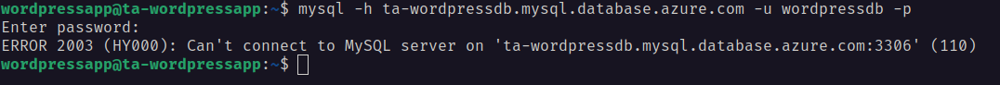 |
| :-----------------------------------------------------------------------: |
|                 Figuur 21. MySQL server niet bereikbaar.                  |

Ga in Azure naar de overzichtspagina van de databankserver en klik in het linkermenu op `Netwerken`.

We voegen een nieuwe firewallregel toe met het publiek IP-adres van onze applicatieserver als begin- en eind-IP-adres (te vinden op de overzichtspagina van de applicatieserver) en bewaar deze configuratie door bovenaan op de knop `Opslaan` te klikken.

Met deze configuratie zorgen we ervoor dat enkel onze applicatieserver toegang kan krijgen tot onze databank. Merk op dat er ook een beveiligde SSL-verbinding met onze databank afgedwongen zal worden. Dit zullen we later ook duidelijk moeten maken aan onze WordPress applicatie!

|  |
| :-------------------------------------------------------------: |
|                Figuur 22. Instellingen firewall.                |

Probeer de verbinding met de MySQL databank opnieuw uit en je zal zien dat deze nu toegankelijk is vanaf de applicatieserver. Met het commando `exit` verbreek je de verbinding.

| 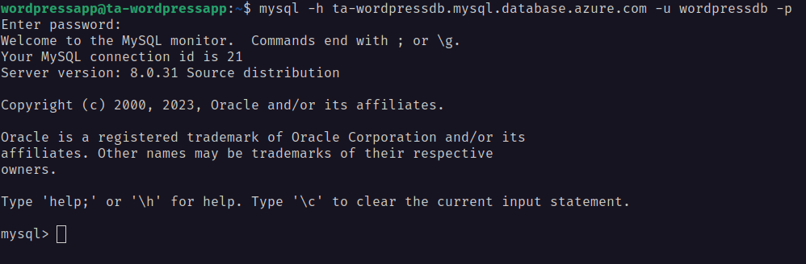 |
| :----------------------------------------------------------: |
|                 Figuur 23. MySQL verbinding.                 |

### Stap 5 - WordPressapplicatie installeren

In stappen 2 en 3 werden de machines die we nodig hebben, nl. een Ubuntu applicatieserver en een databankserver met MySQL opgezet. Door de ingrepen in stap 4 werkt ook de verbinding met de MySQL databankserver vanaf de applicatieserver. Het is nu tijd om de WordPress webapplicatie te installeren op de applicatieserver die de MySQL databank zal gebruiken.

Maak een SSH-verbinding met je applicatieserver (zoals eerder uitgeprobeerd). Surf naar <https://ubuntu.com/tutorials/install-and-configure-wordpress#1-overview> en volg de tutorial om WordPress te installeren. Zorg dat je weet wat elk(e) stap/commando doet en waarom dit nodig is. In de praktijk is het niet altijd zo dat een tutorial 1-op-1 kan gevolgd worden, je moet dus min of meer weten wat er gebeurt. In dit geval is het belangrijk om bij het volgen van de tutorial rekening te houden met volgende zaken:

- **2. Install dependencies**
  - Bij de `apt install` instructie laat je `mysql-server` weg aangezien we reeds een andere machine hebben opgezet als databankserver.

- **4. Configure Apache for WordPress**
  - :bulb: **Tip:** gebruik een teksteditor (bv. `nano` of `vim`) om het bestand `wordpress.conf` aan te maken en de configuratie in te plakken.
  - Het gebruik van `sudo` kan nodig zijn.
  - De configuratie van de hostname mag je overslaan.
  - In deze stap maak je een bestand in de map `/etc/apache2/sites-available`. In de configuratiemap van Apache is er nog een map `/etc/apache2/sites-enabled` **Wat is verschil tussen beide?**

- **5. Configure database**
  - Vergeet niet dat de MySQL databank niet op deze applicatieserver draait. Zie eerder om een verbinding te maken met de databank vanaf de applicatieserver! Ook het laatste commando om mysql op te starten is niet van toepassing.
  - Kies een wachtwoord (hou dit bij in de overzichtstabel). In plaats van localhost gebruik je `'%'` zodat aanmelden lukt vanaf eender welke host en niet alleen lokaal. Samengevat voer je onderstaande commando's achtereenvolgens uit.

  ```sql
  mysql> CREATE DATABASE wordpress;
  mysql> CREATE USER wordpress@'%' IDENTIFIED BY 'wordpresspwd';
  mysql> GRANT SELECT,INSERT,UPDATE,DELETE,CREATE,DROP,ALTER ON wordpress.* TO wordpress@'%';
  mysql> FLUSH PRIVILEGES;
  mysql> QUIT;
  ```

- **6. Configure WordPress to connect to the database**
  - Vergeet niet om het wachtwoord uit stap 5 te gebruiken.
  - Je hoeft de `sed` commando's niet te gebruiken. Je kan ook met een teksteditor de nodige aanpassingen doen in het configuratiebestand, zoals bv.:

  ```shell
  sudo -u www-data nano /srv/www/wordpress/wp-config.php
  ```

  - Bij de opening van het configuratiebestand ga je naast de opgegeven instructies uit te voeren ook zoeken naar de regel voor `DB_HOST`. Voer nu uiteraard de DNS-naam van de databankserver in ipv. `localhost`! (Herinnering: bepaalde gegevens zijn terug te vinden op de overzichtpagina's van de machines in Azure.)

  | 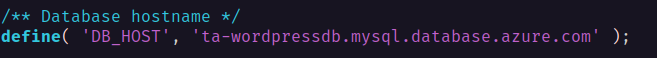 |
  | :------------------------------------------------------------: |
  |                 Figuur 24. Database hostname.                  |

- **7. Configure WordPress**
  - Het is nu tijd om WordPress te configureren.
  - Surf hiervoor naar de DNS-naam van jouw applicatieserver (ipv. `localhost`).
  - Helaas pindakaas... We krijgen een foutmelding die ons meedeelt dat een verbinding met de database niet lukt.

  |  |
  | :------------------------------------------------------------------------------------------------: |
  |                       Figuur 25. Error establishing connection to database.                        |

  - Herinner je nog dat onze verbinding met de databank via een beveiligde SSL-verbinding moet verlopen? Je moet dit nog duidelijk maken aan WordPress! Dit doen we als volgt:

  ```shell
  sudo -u www-data nano /srv/www/wordpress/wp-config.php
  ```

  - Voeg `define('MYSQL_CLIENT_FLAGS', MYSQLI_CLIENT_SSL);` toe aan het bestand, tussen `/* Add any custom values between this line and the "stop editing" line. */` en `/* That's all, stop editing! Happy publishing. */` en bewaar het bestand.

  | 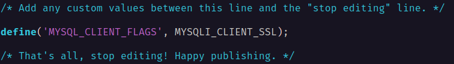 |
  | :------------------------------------------------------: |
  |                  Figuur 26. MySQL SSL.                   |

  - Probeer opnieuw te surfen naar de WordPress applicatie. Als alles goed is verlopen kan je nu WordPress configureren. Volg de instructies en hou je username en wachtwoord voor je blog goed bij. Let's go!

  - Jouw mooie blog is nu klaar waarbij je na het inloggen meteen een eerste bericht kan plaatsen!

|  |
| :----------------------------------------------------------------: |
|                  Figuur 27. Dashboard WordPress.                   |

| 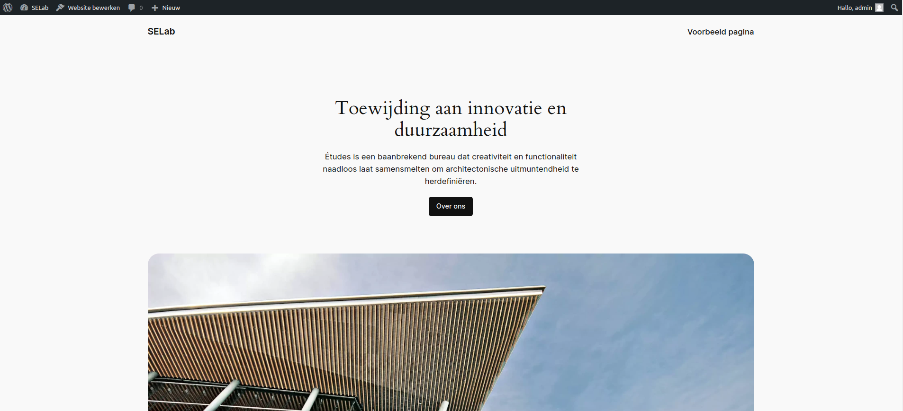 |
| :--------------------------------------------: |
|                Figuur 28. Blog.                |

### Stap 6 - Beveiliging toepassen

Wie goed heeft gekeken, ziet dat de verbinding met de WordPress blog nog niet beveiligd is. In de huidige tijden kunnen we ons dit niet meer permitteren. Elke verbinding moet beveiligd worden met behulp van encryptie om uitwisseling van gegevens onleesbaar te maken voor potentiële hackers.

Gelukkig kunnen we bij [Let's Encrypt](https://letsencrypt.org/) een certificaat ophalen om een beveiligde HTTPS-verbinding op te zetten en kan certbot ons helpen om dit allemaal te automatiseren.

Surf naar <https://certbot.eff.org/instructions?ws=apache&os=ubuntufocal>. Volg de instructies waarbij je rekening houdt met volgende zaken:

- **Stap 1:** je hebt wellicht nog een SSH-verbinding met de applicatieserver waardoor deze stap niet nodig is.
- **Stap 2:** niet nodig om uit te voeren aangezien `snapd` reeds op onze Ubuntu machine aanwezig is.
- **Stap 4:** niet nodig om uit te voeren aangezien er nog geen certbot aanwezig is op de Ubuntu machine.
- **Stap 6:** kies de eerste optie zodat het certificaat ook meteen op de Apache webserver geconfigureerd is! Volg de instructies en geef gepaste antwoorden. De domain name ken je. Dat is de DNS-naam van je applicatieserver die je ook gebruikt om naar je blog te surfen.

| 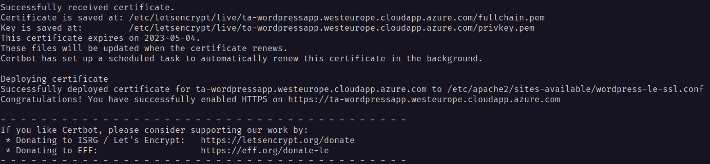 |
| :------------------------------------------------------------------------------------: |
|                      Figuur 29. Certificaat ophalen via certbot.                       |

- Jouw mooie blog is nu veilig toegankelijk via HTTPS door middel van een Let's Encrypt certificaat. Proficiat!

|  |
| :-----------------------------------------------------------------------------------------------: |
|                   Figuur 30. Beveleigde WordPress met letsencrypt certificaat.                    |

### Stap 7 - Machines uitschakelen

Je kreeg via het studentenaanbod van Azure een beperkt krediet van $100 om te besteden. Machines laten draaien kost geld. **Als je er even niet op werkt, schakel je de machines dus best uit!**

Ga hiervoor naar de overzichtpagina's van je machines in Azure en klik bovenaan op `Stoppen`. De status van de machines moet veranderen naar `Gestopt`.

|  |
| :-------------------------------------------------------------: |
|                  Figuur 31. Stoppen machines.                   |

:exclamation: **Let op:** de machines starten na 30 dagen zonder melding opnieuw op. Na het demonstreren van deze opdracht, mag je deze verwijderen.

## Mogelijke uitbreidingen

- Configuur de virtuele machine zodat je kan aanmelden met een SSH key.
- Installeer een ander thema voor je WordPress blog.
- Maak een script voor de installatie van de WordPress blog.
- Voer andere veiligheidsmaatregelen door op de virtuele machine (bv. `fail2ban`).
- De WordPress blog is bereikbaar via een eigen domeinnaam.
  - :bulb: Hint: via het [GitHub Student Developer Pack](https://education.github.com/pack) kan je een gratis domeinnamen registreren bij een aantal aanbieders.
  - Zorg er ook voor dat het certificaat van Let's Encrypt opnieuw wordt aangevraagd en geïnstalleerd voor de nieuwe domeinnaam.
- Kies een service van de [awesome-selfhosted list](https://github.com/awesome-selfhosted/awesome-selfhosted) en installeer deze op een virtuele machine in Azure.
  - Zorg ervoor dat alle services (ook WordPress) bereikbaar zijn via een domeinnaam en dat de verbinding beveiligd is met een certificaat van Let's Encrypt.
