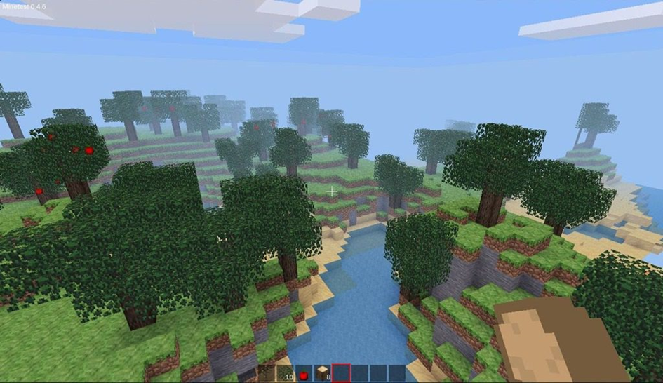

# Opdracht 5 - Docker

In deze opdracht willen we jullie uitgebreider kennis laten maken met [Docker](https://www.docker.com/) en [Docker Compose](https://docs.docker.com/compose/). Het doel van deze opdracht is om een dashboard te bouwen waarin je een overzicht krijgt van de containers die je draait, en om een webhosted password manager te bouwen. Beide applicaties zullen we draaien in Docker containers.

## :mortar_board: Leerdoelen

- Je kan Docker en Docker compose installeren op een Linux machine via de command line.
- Je kan Docker containers installeren en opstarten aan de hand van `docker` commando's.
- Je kan gebruik maken van een Vaultwarden container om jouw wachtwoorden te beheren en aan te vullen in een web browser.
- Je kan gebruik maken van Portainer om Docker containers visueel te beheren.
- Je kan Docker containers installeren en opstarten aan de hand van `docker-compose.yml` bestanden en `docker compose` commando's.
- Je kan een Docker commando vertalen naar een Docker Compose YAML-bestand.

## :memo: Evaluatiecriteria

Toon na afwerken het resultaat aan je begeleider. Elk teamlid moet in staat zijn om het resultaat te demonstreren bij de oplevering van deze opdracht! Criteria voor beoordeling:

- [ ] De `docker-compose.yml` bestanden zijn te vinden op de GitHub repository van de groep.
- [ ] Je kan alle instructies van Docker en Docker compose uitvoeren zonder `sudo` te gebruiken.
- [ ] Je hebt Docker geïnstalleerd en kan dit aantonen met `docker --version`.
- [ ] Je hebt Docker Compose geïnstalleerd en kan dit aantonen met `docker compose version`.
- [ ] Je kan de command line instructies om een Vaultwarden container op te zetten toelichten.
- [ ] Je kan de command line instructies om een Portainer container op te zetten toelichten.
- [ ] Je kan een Vaultwarden container opzetten via Docker Compose op de command line. Je kan surfen via HTTPS naar en inloggen op deze container op het fysieke systeem (bv. via <https://192.168.56.20>).
  - [ ] Je hebt deze ook gekoppeld aan een web browser client op het fysieke systeem.
- [ ] Je kan een Portainer container opzetten via Docker Compose op de command line. Je kan surfen naar en inloggen op deze container op het fysieke systeem (bv. via <http://192.168.56.20>). Portainer en Vaultwarden worden op het Portainer dashboard weergegeven met als status "Running".
- [ ] Je hebt een verslag gemaakt op basis van het template.
- [ ] De cheat sheet werd aangevuld met nuttige commando's die je wenst te onthouden.

## Probleemstelling

In het OLOD Operating Systems kom je in aanraking met Docker. Dankzij Docker kunnen we virtualiseren zonder de nood om volledige virtuele machines (VM's) te draaien. Docker maakt immers gebruik van slechts één besturingssysteem-kernel voor alle kernels, in plaats van een kernel per virtuele machine. Docker wordt daarom vooral gebruikt om individuele applicaties te virtualiseren in plaats van volledige systemen.

Docker kan eenvoudig gebruikt worden door het `docker` commando te gebruiken. Dit commando gaat vaak gepaard met een hele waslijst aan parameters die de Docker container beschrijven of besturen. Aanvullend bestaat er Docker Compose waarbij we gebruik maken van een `docker-compose.yml` bestand om alle informatie over een of meerdere containers te bewaren. Docker Compose bevat ook heel wat extra functionaliteiten, zoals het opstarten van meerdere Docker containers die met elkaar kunnen communiceren in een afgezonderd netwerk.

## Opdracht

## Stap 0 - Voorbereiding

Alvorens je start met deze opdracht is het belangrijk om te begrijpen wat Docker en Docker Compose zijn. Hieronder vind je een aantal links die je kunnen helpen om deze concepten te begrijpen:

- [Docker overview](https://docs.docker.com/get-started/overview/)
- [Docker Compose overview](https://docs.docker.com/compose/)
- [What is Docker in 5 minutes](https://www.youtube.com/watch?v=_dfLOzuIg2o)
- [Learn Docker in 7 Easy Steps](https://www.youtube.com/watch?v=gAkwW2tuIqE)

### Stap 1 - Installatie Docker in een VM

Installeer Docker op een Linux VM naar keuze. Je mag hiervoor gerust dezelfde VM gebruiken als vorige opdrachten, maar experimenteer gerust met andere distributies. In dit geval dat je een andere VM gebruikt, vervang dan in deze opdracht telkens `192.168.56.20` door het IP-adres van jouw VM.

Op de [website van Docker](https://docs.docker.com/engine/install/#server) vind je de installatie-instructies voor een paar populaire distributies. Volg de instructies voor Docker Engine, **niet** voor Docker Desktop. We hebben immers enkel de command line commando's nodig. Gebruik deze als startpunt voor de installatie op jouw VM. Op de detailpagina's van de distributies volg je steeds de instructies onder `Install using the ... repository`. Installeer Docker Engine

Je mag ook zelf op zoek gaan naar de juiste installatie-instructies voor de distributie die je kiest.

Indien de distributie die je kiest gebruik maakt van SELinux kan het zijn dat bepaalde configuratie afwijkt zoals hieronder beschreven. Neem daarvoor ook zeker volgende informatie door: <https://docs.docker.com/storage/bind-mounts/#configure-the-selinux-label>

Het is een goede gewoonte om ook de gebruiker waarmee je bent aangemeld en werkt toe te voegen aan de groep `docker` zodat deze de juiste rechten krijgt om de Docker commando's uit te voeren. Als gevolg van deze stap kan je de commando's in deze opdracht uitvoeren zonder `sudo` ervoor te plaatsen. Je hoeft `${USER}` niet te vervangen door je eigen gebruikersnaam.

- Wat is `${USER}`?
- Welk commando kan je gebruiken om jouw gebruikersnaam te bepalen?

```shell
sudo usermod -aG docker ${USER}
```

:exclamation: **Let op:** Je moet nadien eerst uitloggen uit de VM en opnieuw aanmelden alvorens je Docker commando's kan uitvoeren zonder `sudo` te gebruiken.

Test de installatie uit door de `hello-world` container te draaien. Dit commando zal de `hello-world` container downloaden van Docker Hub en deze lokaal draaien. Als alles goed is geïnstalleerd, zal je onder andere `Hello from Docker!` te zien krijgen.

```console
user@localhost:~$ docker run hello-world
Unable to find image 'hello-world:latest' locally
latest: Pulling from library/hello-world
c1ec31eb5944: Pull complete
Digest: sha256:4bd78111b6914a99dbc560e6a20eab57ff6655aea4a80c50b0c5491968cbc2e6
Status: Downloaded newer image for hello-world:latest

Hello from Docker!
This message shows that your installation appears to be working correctly.

To generate this message, Docker took the following steps:
 1. The Docker client contacted the Docker daemon.
 2. The Docker daemon pulled the "hello-world" image from the Docker Hub.
    (amd64)
 3. The Docker daemon created a new container from that image which runs the
    executable that produces the output you are currently reading.
 4. The Docker daemon streamed that output to the Docker client, which sent it
    to your terminal.

To try something more ambitious, you can run an Ubuntu container with:
 $ docker run -it ubuntu bash

Share images, automate workflows, and more with a free Docker ID:
 https://hub.docker.com/

For more examples and ideas, visit:
 https://docs.docker.com/get-started/
```

### Stap 2 - Installatie Vaultwarden

In het OLOD Cybersecurity is duidelijk geworden dat je voor elk account best een ander wachtwoord kiest. Omdat het voor mensen zo goed als onmogelijk is om allerlei verschillende wachtwoorden voor verschillende websites en apps te onthouden, wordt er best gebruik gemaakt van een password manager. In Cybersecurity heb je gezien dat er twee verschillende soorten password managers bestaan: webhosted password managers die de wachtwoorden geëncrypteerd bewaren in de cloud, en containerbased password managers die de wachtwoorden opslaan in een geëncrypteerde container op het toestel zelf.

Hier gaan we gebruik maken van Docker om zelf een webhosted password manager te bouwen. [Bitwarden](https://bitwarden.com/) is een open source webhosted password manager die we zelf kunnen hosten op een eigen server. We gaan dus eigenlijk een eigen private cloud oprichten. Je kan dan vanop verschillende toestellen inloggen op Bitwarden op jouw eigen server om gebruikersnamen en wachtwoorden op te halen.

De Bitwarden applicatie is bedoeld voor grote hoeveelheden gebruikers (bv. voor alle studenten van HOGENT, alle werknemers van een bedrijf...) en is dus te zwaar voor een eenvoudige VM. Daarom maken we hier gebruik van een lichtere compatibele open source versie, namelijk [Vaultwarden](https://github.com/dani-garcia/vaultwarden).

Installeer Vaultwarden volgens de instructies op <https://github.com/dani-garcia/vaultwarden#installation>.

- Welke commando's gebruik je hiervoor?
- Wat doet het `docker pull` commando?
- Hoe kan je alle lokale images bekijken?
- Hoe bekijk je alle lokaal draaiende containers?
- Hoe bekijk je alle lokale containers (inclusief de gestopte containers)?

:bulb: Een aantal **tips** die je kunnen helpen bij de installatie:

- Vergeet niet om de firewall te configureren op de VM.
- Gebruik de map `~/.files-vaultwarden` voor het Docker volume in plaats van de map `/vw-data/` .

Je kan al eens kijken of je Vaultwarden kan bereiken op <http://192.168.56.20> vanop jouw fysiek toestel.

:exclamation: **Let op:** Indien je een VM gebruikt van een vorige opdracht, zorg er dan voor dat Apache niet is uitgeschakeld en bereikbaar blijft. Je verandert dan best het poortnummer in de port-mapping in het Docker commando, zodat je de Vaultwarden container kan bereiken op <http://192.168.56.20:poortnummer>, terwijl Apache bereikbaar blijft op poort 80 (<http://192.168.56.20>) en 443 (<https://192.168.56.20>). Vergeet dit poortnummer ook niet telkens toe te voegen waar nodig tijdens de rest van deze opdracht.

Vaultwarden heeft HTTPS nodig om goed te functioneren. Gebruik terug een self-signed certificate om HTTPS op te zetten. Normaal voorzie je HTTPS aan de hand van een reverse proxy. Aangezien dit buiten de scope ligt van dit OLOD en een stuk meer configuratiewerk vereist, is de werkwijze met Rocket hier toegelaten: <https://github.com/dani-garcia/vaultwarden/wiki/Enabling-HTTPS#via-rocket>. Als dit werkt, kan je Vaultwarden bereiken op <https://192.168.56.20> (let op de "s" in "http**s**").

- Waarom heeft Vaultwarden HTTPS nodig?

Maak jouw account aan op jouw Vaultwarden applicatie.

:bulb: **Tip:** voeg de credentials toe in de beschrijving van de VM.

Kan je jouw Vaultwarden verbinden met Bitwarden clients? Een lijst van mogelijke clients voor desktop, browser plug-ins... kan je vinden op <https://bitwarden.com/download/> . In onze testomgeving maken we gebruik van browser plug-ins (bv. Chrome of Firefox). De desktop apps ervaren problemen met ons self-signed certificate. Zorg ervoor dat op zijn minst de browser plugin werkt voor een browser naar keuze op jouw fysiek systeem. Test gerust meerdere uit.

### Stap 3 - Installatie Portainer

Het beheer van Docker containers en images gebeurt vaak via de command line met het `docker` commando. Er bestaan ook dashboards waarop je heel visueel in één oogopslag kan zien welke containers actief zijn. Vaak kan je Docker containers dan ook via zo'n dashboard beheren. Een voorbeeld van een dergelijk dashboard is [Portainer](https://www.portainer.io/) . Portainer kan je ook hosten met Docker. Denk hier even over na: we beheren Docker containers vanuit een container. Dit is een beetje tegenstrijdig, maar het kan.

Installeer de Community Edition van Portainer volgens de instructies op <https://docs.portainer.io/start/install-ce/server/docker/linux>.

- Welke commando's gebruik je hiervoor?

:bulb: Een aantal **tips** die je kunnen helpen bij de installatie:

- Vergeet niet om de firewall te configureren op de VM.
- Je kan in plaats van het Docker volume `portainer_data` ook gebruik maken van een volume gekoppeld aan een map (bv. `~/.files-portainer`) op jouw VM zoals bij Vaultwarden. Hoe stel je dit in? Wat is het verschil tussen een Docker volume (= volume) en een map op jouw VM gemount als volume (= bind mount)?

:exclamation: **Let op:** Indien je een VM gebruikt van een vorige opdracht, zorg er dan voor dat Apache niet is uitgeschakeld en bereikbaar blijft. Je verandert dan best het poortnummer in de port-mapping in het Docker commando, zodat je de Portainer container kan bereiken op <http://192.168.56.20:poortnummer>, terwijl Apache bereikbaar blijft op poort 80 (<http://192.168.56.20>) en 443 (<https://192.168.56.20>). Vergeet dit poortnummer ook niet telkens toe te voegen waar nodig tijdens de rest van deze opdracht.

Surf naar <http://192.168.56.20> en maak een admin account aan op jouw Portainer applicatie.

:bulb: **Tip:** voeg de credentials toe in de beschrijving van de VM.

- Inspecteer jouw containers: kan je de Portainer en Vaultwarden containers zien?
- Kan je de Vaultwarden afsluiten en terug opstarten via Portainer?

### Stap 4 - Docker Compose

Een `docker run` commando start slechts één container en wordt snel heel lang. Docker Compose is een tool die je kan gebruiken om meerdere Docker containers tegelijk te beheren. Het laat toe om meerdere containers te definiëren in een YAML-bestand. Docker Compose kan vervolgens met één commando alle containers tegelijk opstarten, stoppen, verwijderen... Uiteraard kan je nog steeds de containers individueel beheren.

Indien je de installatie-instructies van Docker uit stap 1 volgde, heb je normaal reeds Docker Compose geïnstalleerd op je VM. Controleer dit met volgend commando:

```console
docker compose version
```

Toont dit commando geen versie? Installeer Docker Compose dan volgens de instructies op <https://docs.docker.com/compose/install/#scenario-two-install-the-compose-plugin>, gebruikmakend van de Docker repository.

:exclamation: **Let op:** Vroeger was Docker Compose een aparte tool die je apart moest installeren. Sinds 26 april 2022 is deze oude versie van Docker Compose gemarkeerd als deprecated (niet meer ondersteund) en zal dus op termijn helemaal verdwijnen. Vanaf nu wordt Docker Compose geïnstalleerd als plugin voor Docker; dit noemt men ook Docker Compose V2. Plugins zijn een manier om de functionaliteiten van Docker uit te breiden. Online zal je nog veel tutorials vinden die gebruik maken van de oude versie van Docker Compose. Let er dus op dat je het commando `docker compose` gebruikt in plaats van `docker-compose` (geen koppelteken dus). Dit is een belangrijk verschil! In deze opdracht maken we gebruik van Docker Compose V2.

### Stap 5 - Werken met een `docker-compose.yml` bestand

Maak een bestand genaamd `docker-compose.yml` met volgende inhoud:

```yml
services:
  vaultwarden:
    image: vaultwarden/server:latest
    container_name: vaultwarden
    ports:
      - 4123:80
    volumes:
      - ~/.files-vaultwarden:/data
```

Dit bestand komt overeen met onderstaand Docker commando waarbij je Vaultwarden kan bereiken op poort `4123`. Merk op: je mag geen `~` gebruiken in het pad van een volume in het `docker run` commando. Je moet hier een absoluut pad gebruiken. In het `docker-compose.yml` bestand kan je wel gebruik maken van `~` om naar jouw home directory te verwijzen.

```console
docker run --name vaultwarden -v "${HOME}/.files-vaultwarden:/data/" -p 4123:80 vaultwarden/server:latest
```

Je kan dit Docker Compose bestand activeren met behulp van volgend commando. Wat doet de `-d` optie?

```console
docker compose up -d
```

Als je deze overeenkomst ziet, hoe kan je het Docker commando voor jouw Portainer applicatie omvormen naar een `docker-compose.yml` bestand?

Het commando `docker compose up` zoekt steeds naar het `docker-compose.yml` bestand in de huidige map. Alleen heb je hier twee containers die je wil virtualiseren. Er zijn een aantal oplossingen:

- Je maakt voor zowel Vaultwarden als Portainer een aparte map met elk hun eigen `docker-compose.yml` bestand en voert daarin het commando uit. **Dit is de meest aangeraden methode om het overzicht van al jouw Docker projecten te bewaren.**
- Je maakt zowel een `docker-compose-vaultwarden.yml` als een `docker-compose-portainer.yml` bestand en selecteert dan het juiste bestand met de `-f` optie.
- Je maakt een enkel `docker-compose.yml` bestand met daarin beide containers in. Is dit verstandig? Waarom wel of niet?.

Hoe verwijder je eenvoudig alle containers uit jouw `docker-compose.yml` bestand zonder gebruik te maken van `docker stop` en `docker rm`?

### Stap 6 - Opruimen

Het is perfect mogelijk dat je wat rommel achterlaat als je met Docker werkt, bv. ongebruikte images, volumes... . Tijdens deze opdracht heb je waarschijnlijk allerlei dingen uitgeprobeerd. Het is dus een goed idee om alles op te ruimen. Hoe kan je met één commando alle containers, images, networks en volumes verwijderen die niet meer in gebruik zijn?

Je zal in de documentatie **unused images** en **dangling images** tegenkomen. Wat is het verschil tussen beide?

## Mogelijke uitbreidingen

- Zorg ervoor dat Vaultwarden en Portainer automatisch opstarten bij het opstarten van de VM.
- Installeer vorige opdrachten m.b.v. Docker. Dit is mogelijk met volgende opdrachten:
  - opdracht 2 (databankserver)
  - opdracht 3 (webserver)
  - opdracht 4 (Azure)
    - :bulb: **Hint:** bouw de afzonderlijke componenten van Azure na in Docker containers en gebruik Docker Compose om deze te verbinden.
- Maak een MineTest server aan: velen van jullie zullen de term "server" voor het eerst gehoord hebben bij multiplayer games. De server is het toestel waarop een match/wereld/... gehost wordt. De server zorgt er ook voor dat gamers samen kunnen spelen door hen te joinen in deze match/wereld/... . Je kan met behulp van Docker een [dedicated Minetest server](https://docs.linuxserver.io/images/docker-minetest/) opzetten. Minetest is een open source Minecraft clone en is volledig gratis te downloaden op <https://www.minetest.net/> .
  - Wat betekent "dedicated" hier?
  - Probeer ook of andere teamleden via een LAN-netwerk kunnen inloggen op de Minetest server zodat jullie samen kunnen spelen. Wat moet je hiervoor aanpassen of instellen?
    - :exclamation: **Let op:** Het schoolnetwerk zal de verbindingen tegenhouden. Als je dit op de campus wil uittesten, maak je best even gebruik van een mobiele hotspot.

|  |
| :------------------------------------: |
|          Figuur 1. Minetest.           |
