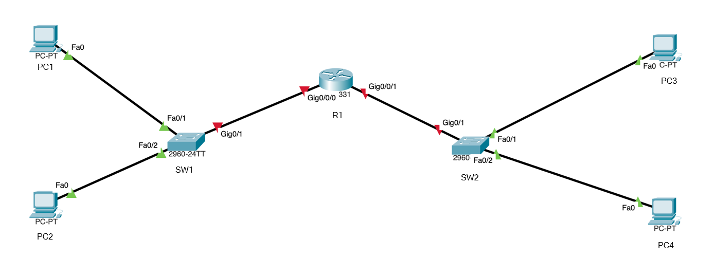

# Opdracht 7 - Het opzetten, configureren en testen van een eenvoudig netwerk in Packet Tracer

In deze opdracht zal je een compleet IPv4- en IPv6-netwerk opzetten met PC's, switches en een router in Cisco [Packet Tracer](https://www.netacad.com/courses/packet-tracer).

De instructies in deze opdracht zijn wat bondiger. Je zal beroep moeten doen op de kennis en ervaring die je hebt opgedaan in het OLOD Computer Networks I.

## :mortar_board: Leerdoelen

- Je kan een correct addresseringsschema opstellen voor IPv4 en IPv6.
- Je kan een gesimuleerd netwerk opzetten in Cisco Packet Tracer.
- Je kan een router, switch en computer correct instellen en zo het gesimuleerd netwerk functioneel maken.
- Je kan een SSH-verbinding opzetten naar een router of switch.

## :memo: Evaluatiecriteria

Toon na afwerken het resultaat aan je begeleider. Elk teamlid moet in staat zijn om het resultaat te demonstreren bij de oplevering van deze opdracht! Criteria voor beoordeling:

- [ ] Je hebt een correct adresseringsschema voor IPv4 uitgewerkt en kan dit toelichten.
- [ ] Je hebt een correct adresseringsschema voor IPv6 uitgewerkt en kan dit toelichten.
- [ ] PC1 kan pingen naar SW1, R1, SW2 en PC4 over IPv4.
- [ ] PC1 kan pingen naar PC4 over IPv6.
- [ ] De begeleider selecteert willekeurig een van volgende toestellen: SW1, R1, SW2. Je kan op dit toestel het volgende demonstreren:
  - [ ] Je kan inloggen via de consolekabel.
  - [ ] Er is een wachtwoord ingesteld voor console en privileged EXEC mode.
  - [ ] Er is een MOTD ingesteld.
  - [ ] Wachtwoorden staan geëncrypteerd in de running config.
  - [ ] Er zijn geen ongewenste DNS lookups.
  - [ ] De startup config is weggeschreven.
  - [ ] Je kan via IPv4 pingen naar zowel SW1, R1, SW2.
- [ ] Je kan vanuit PC1 een SSH-verbinding openen naar SW1 en R1 via IPv4.
- [ ] Je hebt een verslag gemaakt op basis van het template.
- [ ] De cheat sheet werd aangevuld met nuttige commando's die je wenst te onthouden voor later.

## Probleemstelling

Een bedrijf of organisatie kan tegenwoordig niet meer functioneren zonder een netwerk. Een netwerk gebruikt **switches** om toestellen met elkaar te verbinden en **routers** om netwerken met elkaar te verbinden. In onze simulatie willen we graag twee subnetten opstellen en deze met elkaar verbinden volgens de **topologie** zoals weergegeven in onderstaande figuur.

|  |
| :-------------------------------------------: |
|          Figuur 1. Netwerktopologie.          |

## Opdracht

### Stap 1 - Topologie

- Zorg ervoor dat je de laatste versie van Packet Tracer geïnstalleerd hebt.
- Bouw in Packet Tracer een netwerk zoals op bovenstaand schema.
  - Dit netwerk heeft **twee subnetten**:
    - Subnet 0: hosts PC1 en PC2, switch SW1, interface G0/0/0 van R1.
    - Subnet 1: hosts PC3 en PC4, switch SW2, interface G0/0/1 van R1.

  - De router is een **4331 Cisco router**.
  - De switches zijn elk een **2960 Cisco switch**.

- Verbind de toestellen met de juiste kabels.
- Je zal de computers PC1, PC2 en PC3 gebruiken om in te loggen op de switches en routers, en deze vervolgens te configureren. Verbind dus de volgende toestellen met behulp van **consolekabels**:
  - PC1 met switch SW1
  - PC2 met router R1
  - PC3 met switch SW2

### Stap 2 - Adresseringsschema voor IPv4

- Bepaal het te subnetten netwerk en dus het **netwerkadres** a.d.h.v.:
  - een random gegenereerd IPv4-adres via <https://commentpicker.com/ip-address-generator.php>;
  - een random gegenereerde prefixlengte via <https://www.random.org/integers/?num=1&min=8&max=24&col=5&base=10&format=html&rnd=new>;
  - :exclamation: **Let op:** Kies een andere prefixlengte dan een /8, /16 of /24.
- Verdeel dit netwerk in 4 subnetten van gelijke grootte.
- Geef voor elk subnet het netwerkadres, broadcastadres, de subnetmask en het maximum aantal uitdeelbare hostadressen. Vergeet dit niet op te nemen in het verslag.
- Vul onderstaande tabel aan. Je mag zelf de IPv4-adressen kiezen waar mogelijk.

| **Toestel** | **Interface** | **Subnetnr.** | **IPv4-adres** | **Subnetmask** | **IPv4-adres default gateway** |
| ----------- | ------------- | ------------- | -------------- | -------------- | ------------------------------ |
| PC1         | NIC           | 0             |                |                |                                |
| PC2         | NIC           | 0             |                |                |                                |
| PC3         | NIC           | 1             |                |                |                                |
| PC4         | NIC           | 1             |                |                |                                |
| SW1         | VLAN 1        | 0             |                |                |                                |
| SW2         | VLAN 1        | 1             |                |                |                                |
| R1          | G0/0/0        | 0             |                |                | n.v.t.                         |
| R1          | G0/0/1        | 1             |                |                | n.v.t.                         |

### Stap 3 - Adresseringsschema voor IPv6

Er bestaan verschillende types IPv6-adressen zoals de link-local adressen (LLA's) en global unicast adressen (GUA's). We moeten minstens die twee types configureren op onze interfaces. Wat is het verschil tussen een LLA en een GUA? Wat is hun functie?

#### Toekenning van link-local adressen (LLAs)

- De PC's hebben zelf al een link-local adres gegenereerd van zodra IPv6 geactiveerd werd.
- Voor de interfaces G0/0/0 en G0/0/1 op router R1 gebruiken we FE80::1 als link-local adres. Verklaar waarom je aan beide interfaces op R1 hetzelfde link-local adres kan toekennen.

#### Toekenning van global unicast adressen (GUAs)

- Genereer een random IPv6-adressenbereik voor elk subnet via <https://simpledns.plus/private-ipv6>.
- Bepaal de IPv6-netwerken als volgt:
  - Prefixlengte = 64;
  - Prefix (48 bit) = de zopas gegenereerde "Prefix/L", gevolgd door "Global ID";
  - Subnet-ID (16 bit) = 0 voor subnet 0 en 1 voor subnet 1.
- Vul onderstaande tabel aan. Je mag zelf de interface-IDs kiezen waar mogelijk. Denk goed na over het IPv6-adres (LLA of GUA?) die je als default gateway adres zult gebruiken.

| **Toestel** | **Interface** | **Subnet** | **IPv6-adres** | **IPv6-prefixlengte** | **IPv6-adres default gateway** |
| ----------- | ------------- | ---------- | -------------- | --------------------- | ------------------------------ |
| PC1         | NIC           | 0          |                | /64                   |                                |
| PC2         | NIC           | 0          |                | /64                   |                                |
| PC3         | NIC           | 1          |                | /64                   |                                |
| PC4         | NIC           | 1          |                | /64                   |                                |
| SW1         | VLAN 1        | 0          |                | /64                   |                                |
| SW2         | VLAN 1        | 1          |                | /64                   |                                |
| R1          | G0/0/0        | 0          |                | /64                   | n.v.t.                         |
| R1          | G0/0/1        | 1          |                | /64                   | n.v.t.                         |

### Stap 4 - Bijwerken software op router/switch

Sommige commando's uit de volgende stappen werken enkel indien de software versie op jouw switch of router 15 of hoger is. Dit controleer je via het commando `show version`. Is dat niet zo dan voer je eerste de instructies uit zoals vermeld op deze site: <https://yaser-rahmati.gitbook.io/rahmati-academy/Tutorials-Library/cisco-adademy/cisco-packet-tracer/use-a-tftp-server-to-upgrade-a-cisco-ios-image>. Je voert de instructies op elk apparaat afzonderlijk uit tot elke router en switch over minstens versie 15 beschikt.

### Stap 4 - Configuratie van de PC's

- Stel voor elke PC het statisch IPv4-adres, de subnetmask en de default gateway in.
- Stel voor elke PC het statisch IPv6-adres (GUA), de prefixlengte en de default gateway in.

### Stap 5 - Configuratie van de switches

Configureer elke switch als volgt:

- Maak verbinding met de switch via de consolekabel.
- Geef de switch een naam volgens de gegeven tabel.
- Voorkom ongewenste DNS lookups.
- Stel wachtwoorden in voor de priviliged EXEC mode en de toegang tot de console (VTY lines).
- Zorg ervoor dat wachtwoorden niet leesbaar zijn in de configuratie.
- Stel de volgende MOTD (= Message Of The Day) banner in: `Toegang enkel voor bevoegden!`.
- Schakel ondersteuning voor IPv6 in met behulp van volgende commando's.

```cisco
Switch# configure terminal
Switch(config)# sdm prefer dual-ipv4-and-ipv6 default
Switch(config)# end
Switch# copy running-config startup-config
Switch# reload
```

- Stel de SVI (= Switch Virtual Interface) in voor zowel IPv4 als IPv6.

  - Vergeet de default gateway niet in te stellen!

  - Voor IPv6 heb je geen commando om een default gateway in te stellen maar moet je een statische default route instellen in de global configuration mode als volgt:

    ```cisco
    Switch# ipv6 route ::/0 <GUA van de gateway van het netwerk waartoe de switch behoort>
    # bv.: ipv6 route ::/0 FD28:BA76:8057:1::1
    ```

- Bewaar de configuratie zodat deze niet verloren raakt bij een `reload` van de switch en test dit uit.
- Hoe toon je de huidige configuratie?
- Hoe toon je de IOS-versie?
- Hoe toon je een overzicht van de interfaces (IPv4 en IPv6)?
  - Waarom heeft Vlan1 2 IPv6-adressen?
- Test de verbindingen uit (voor zowel IPv4 als IPv6). Duid in de volgende tabel aan met `ja` of `nee` of je kan pingen tussen de toestellen:

IPv4:

| **Van/naar** | **PC1** | **PC2** | **SW1** | **R1 (G0/0/0)** | **R2 (G0/0/1)** | **SW2** | **PC3** | **PC4** |
| ------------ | ------- | ------- | ------- | --------------- | --------------- | ------- | ------- | ------- |
| PC1          | n.v.t.  |         |         |                 |                 |         |         |         |
| PC2          |         | n.v.t.  |         |                 |                 |         |         |         |
| SW1          |         |         | n.v.t.  |                 |                 |         |         |         |
| SW2          |         |         |         |                 |                 | n.v.t.  |         |         |
| PC3          |         |         |         |                 |                 |         | n.v.t.  |         |
| PC4          |         |         |         |                 |                 |         |         | n.v.t.  |

IPv6:

| **Van/naar** | **PC1** | **PC2** | **SW1** | **R1 (G0/0/0)** | **R2 (G0/0/1)** | **SW2** | **PC3** | **PC4** |
| ------------ | ------- | ------- | ------- | --------------- | --------------- | ------- | ------- | ------- |
| PC1          | n.v.t.  |         |         |                 |                 |         |         |         |
| PC2          |         | n.v.t.  |         |                 |                 |         |         |         |
| SW1          |         |         | n.v.t.  |                 |                 |         |         |         |
| SW2          |         |         |         |                 |                 | n.v.t.  |         |         |
| PC3          |         |         |         |                 |                 |         | n.v.t.  |         |
| PC4          |         |         |         |                 |                 |         |         | n.v.t.  |

- Waarom geeft de eerste ping soms een `Request timed out.` foutmelding terwijl de volgende drie wel lukken?

### Stap 6 - Configuratie van de router

Configureer de router als volgt:

- Maak verbinding met de router via de consolekabel.
- Geef de router een naam volgens de gegeven tabel.
- Voorkom ongewenste DNS lookups.
- Stel wachtwoorden in voor de priviliged EXEC mode en de toegang tot de console (VTY lines).
- Zorg ervoor dat wachtwoorden niet leesbaar zijn in de configuratie.
- Stel de volgende MOTD (= Message Of The Day) banner in: `Toegang enkel voor bevoegden!`.
- Zet ondersteuning voor IPv6 aan met behulp van het `ipv6 unicast-routing` commando.
- Stel de interfaces in voor zowel IPv4 als IPv6.
  - Stel voor elke interface ook een beschrijving in die beschrijft met welke switch deze interface verbonden is: `LAN to SW1`, `LAN to SW2`.
- Bewaar de configuratie zodat deze niet verloren raakt bij een `reload` van de router en test dit uit.
- Test de verbindingen uit (voor zowel IPv4 als IPv6). Duidt in de volgende tabel aan met `ja` of `nee` of je kan pingen tussen de toestellen:

IPv4:

| **Van/naar** | **PC1** | **PC2** | **SW1** | **R1 (G0/0/0)** | **R2 (G0/0/1)** | **SW2** | **PC3** | **PC4** |
| ------------ | ------- | ------- | ------- | --------------- | --------------- | ------- | ------- | ------- |
| PC1          | n.v.t.  |         |         |                 |                 |         |         |         |
| PC2          |         | n.v.t.  |         |                 |                 |         |         |         |
| SW1          |         |         | n.v.t.  |                 |                 |         |         |         |
| R1           |         |         |         | n.v.t.          | n.v.t.          |         |         |         |
| SW2          |         |         |         |                 |                 | n.v.t.  |         |         |
| PC3          |         |         |         |                 |                 |         | n.v.t.  |         |
| PC4          |         |         |         |                 |                 |         |         | n.v.t.  |

 IPv6:

| **Van/naar** | **PC1** | **PC2** | **SW1** | **R1 (G0/0/0)** | **R2 (G0/0/1)** | **SW2** | **PC3** | **PC4** |
| ------------ | ------- | ------- | ------- | --------------- | --------------- | ------- | ------- | ------- |
| PC1          | n.v.t.  |         |         |                 |                 |         |         |         |
| PC2          |         | n.v.t.  |         |                 |                 |         |         |         |
| SW1          |         |         | n.v.t.  |                 |                 |         |         |         |
| R1           |         |         |         | n.v.t.          | n.v.t.          |         |         |         |
| SW2          |         |         |         |                 |                 | n.v.t.  |         |         |
| PC3          |         |         |         |                 |                 |         | n.v.t.  |         |
| PC4          |         |         |         |                 |                 |         |         | n.v.t.  |

- Hoe toon je de **routeringstabel**?
  - Hoeveel routes zijn aangeduid met `C`? Wat betekent dit?
  - Hoeveel routes zijn aangeduid met `L`? Wat betekent dit?
  - Hoe kan je de IP-adressen van de interfaces zien (IPv4 en IPv6) en welke interfaces up of down zijn?
  - Hoe kan je de MAC-adressen terugvinden van de interfaces?
- Een default gateway hoeft niet geconfigureerd te worden op een router. Waarom niet? Wanneer zou je in de plaats hiervan wel een **default route** configureren?

### Stap 7 - Instellen SSH-toegang

Configureer de switches en router als volgt:

- Stel het domein `selabs.local` in voor het toestel.
- Genereer een 2048 bits RSA-sleutelpaar.
- Zorg ervoor dat SSH versie 2 wordt gebruikt.
- Configureer een lokale gebruiker voor SSH.
- Activeer SSH op de VTY lines, maar geen telnet. Waarom schakelen we telnet uit?
- Configureer de login methode zodat de credentials van de lokale gebruiker opgevraagd worden bij het tot stand brengen van een SSH-verbinding.
- Bewaar de configuratie zodat deze niet verloren raakt bij een `reload` van het toestel.
- Test uit of je met elk toestel een SSH-verbinding tot stand kan brengen. Gebruik het SSH-commando (bv. `ssh -l admin 192.168.1.1`). Duid in de volgende tabel aan met `ja` of `nee` of de SSH-verbinding tussen de toestellen lukt:

| **Van/naar** | **SW1** | **R1 (G0/0/0)** | **R1 (G0/0/1)** | **SW2** |
| ------------ | ------- | --------------- | --------------- | ------- |
| PC1          |         |                 |                 |         |
| PC3          |         |                 |                 |         |

- Werkt SSH ook met IPv6?
  - Tip: voer een `reload` uit op R1, SW1 en SW2 alvorens dit te testen
- Wat is de "SSH timeout" en "maximum authentication retries"? Hoe stel ik deze in op 60 seconden en 3 retries?

### Stap 8 - Reflectie

- Welke subnetting (IPv4 of IPv6) was voor jou het makkelijkst uit te voeren? Waarom?
- Wat was voor jou de moeilijkste stap van de gehele opdracht?
